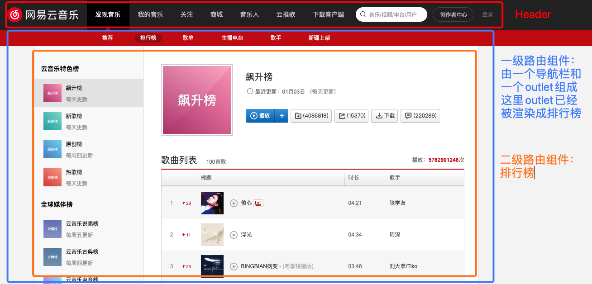

# React

## JSX的本质

JSX就是允许我们在JS代码中穿插一些HTML的组件的语法，如下所示：

```react
...
render() {
	return (
  <div> 
    <button id="lhy">
      Hit
    </button>
  </div>
) // 这就是jsx语法，它不能被原生JS正常编译，会产生语法错误
}
```

JSX本质其实就是React.createElement的语法糖，当我们写出上述的JSX语法代码之后，Babel会帮我们自动将其解析成为React的代码。

React.createElement 会接受3个参数，分别是type, config, children，其中：

- type 为 html元素的类型
- config 为传入组件中的 props
- children 为该组件的子组件对象

上述的JSX代码经过babel转换后会成为如下代码

```js
/*#__PURE__*/ React.createElement(
  "div",
  null,
  /*#__PURE__*/ React.createElement(
    "button",
    {
      id: "lhy"
    },
    "Hit"
  )
);

```


## 虚拟DOM

从上一节中可以看到 React.createElement 最终会返回一个 ReactElement 对象，这个对象有一个 children 属性，其值也是一个 ReactElement 对象。这样就组成了一个由 ReactElement 组成的对象树，而这个对象树就是“虚拟DOM“

```jsx
(
  <div>
    <h2>
      <div>Hello</div>
    </h2>
    <button id="cmq">
      Hit
    </button>
    <button id="lhy">
      Hit
    </button>
  </div>
)
```

```js
/*#__PURE__*/ React.createElement(
  "div",
  null,
  /*#__PURE__*/ React.createElement(
    "h2",
    null,
    /*#__PURE__*/ React.createElement("div", null, "Hello")
  ),
  /*#__PURE__*/ React.createElement(
    "button",
    {
      id: "cmq"
    },
    "Hit"
  ),
  /*#__PURE__*/ React.createElement(
    "button",
    {
      id: "lhy"
    },
    "Hit"
  )
);
// 这颗对象树就是我们的虚拟DOM
```

因此，我们整个JSX-真实DOM的流程就是：JSX代码经过babel编译，得到ReactElement对象树（虚拟DOM），再经过原生平台的渲染，成为真实DOM

虚拟DOM最关键的两个作用：

1. 提高性能：通过虚拟DOM，我们不用每次在页面更新的时候，都去更新整个真实DOM，而是可以在新虚拟DOM和老虚拟DOM之间进行一个快速Diff算法，来得出需要更新的部分，并且只更新这一部分，从而达到提升性能的目的
2. 多平台支持：虚拟DOM只是一个JS对象，这代表它具有更高的灵活性。在Web开发中，它可以被 `document.createElement` 这种HTML的语法渲染成HTML组件，同样的，React-Native可以将这个JS对象渲染成苹果，安卓等平台的原生组件

## 脚手架

脚手架是即用的工程项目模版，每个框架都有自己的脚手架。React的脚手架为`create-react-app`, 它使用node.js编写，打包工具则是基于webpack。

```cmd
# install scaffold
npm install create-react-app -g

# create your app
cd path/to/folder
create-react-app your-app-name

# run your app
cd your-app-name/
npm run start # we can see the command in package.json
```

脚手架目录结构介绍


## 组件的类型划分

React是基于组件式开发的思想，组件是构成整个React APP的基本单位。根据不同的准则，可以将React中的组件划分为：

1. 按照声明方式划分：类组件和函数式组件
2. 按照有无状态管理划分：有状态组件和无状态组件
3. 按照职责划分：容器组件和渲染组件（容器组件注重数据的逻辑计算，而渲染组件主要用于UI渲染）

## JSX组件能够返回的数据类型

当类组件的render函数或者函数组件的return语句被调用时，它会检查`this.props`和`this.state`的变化并返回以下类型之一：

1. React元素：即我们通过JSX语法创建的东西（<div>hahaha</div>），HTML的原生组件如div，会被渲染成DOM节点，而<MyComponent>这种则会被渲染成自定义组件
2. 字符串或数值类型：会在DOM中被渲染成文本节点
3. 布尔类型或者Null：什么都不渲染
4. 数组或者Fragments：使render方法能够返回多个元素，这些元素会被遍历并渲染
5. Portals：可以使该元素被渲染到不同的DOM子树当中去

## 组件的生命周期

组件的生命周期仅用于类组件，函数组件是没有明确的生命周期及其函数定义的。在函数组件当中，我们通常是使用各类hook函数来模拟生命周期。下面是简化版和详细版的生命周期示意图。


1. Constructor

   当要渲染一个组件的时候，第一步就是先实例化该组件，得到一个JSX Element。类组件的构造函数通常只做两件事情：

   - 初始化内部的state
   - 为事件绑定this实例

   因此，如果不需要在类组件内进行state初始化或者this绑定，则不需要为类组件写构造函数

2. componentDidMount

   该函数会在组件挂载（插入DOM树中）后立即调用。

   该生命周期阶段通常适用于进行下列操作：

   - 依赖于DOM的操作
   - 发送网络请求
   - 添加一些订阅（取消订阅则在componentWillUnmount中进行）

3. componentDidUpdate

   该函数会在组件在DOM中被更新后被立即调用，首次渲染则不会执行此方法。

   该生命周期阶段通常适用于进行下列操作：

   - 当组件更新后，可以对DOM进行一些操作
   - 如果对更新前后的props进行了比较，也可以选择在此处进行网络请求（若props更新则发送网络请求）

4. componentWillUnmount

   该函数会在组件卸载及销毁之前直接调用。

   该生命周期阶段通常适用于进行下列操作：

   - 执行必要的清理操作，防止内存泄漏。例如清除timer、取消未完成的网络请求以及取消订阅等等

5. getDerivedStateFromProps（罕见，几乎不使用）

   state的值在任何时候都依赖于props的时候使用。该方法返回一个对象来更新state

6. shouldComponentUpdate

   该函数会在props和state改变后，再次调用render函数之前调用。

   该函数用于自定义组件重渲染规则。

7. getSnapshotBeforeUpdate

   该函数会在DOM更新之前执行，可以获取DOM更新前的一些信息（比如说，我们可以通过该函数返回DOM更新前的滚动位置，这个位置信息将在componentDidUpdate的参数列表中拿到，然后我们可以把新旧两个滚动位置进行对比，根据结果实现一些操作）

   ```jsx
   componentDidUpdate(prevProps, prevState, snapshot) {
     console.log(snapshot.scrollPosition) // 在这里可以拿到getSnapshotBeforeUpdate返回的值
   }
   
   getSnapshotBeforeUpdate() {
     return {
       scrollPosition: this.getScrollPosition()
     }
   }
   ```

   

## 组件间通信

### 参数类型验证和默认参数

如果使用的是Typescript，那么语言特性直接就能做到参数类型验证。

如果使用的是Javascript，那么需要使用到 `propTypes` 来进行参数类型验证

```javascript
import React from 'react'
import PropTypes from "prop-types"

export function MainBanner (props) {
  ...
}

// 参数类型验证
MainBanner.propTypes = {
  banners: PropTypes.string,
  title: PropTypes.string
}
  
// 默认参数
MainBanner.defaultProps = {
  banner: "defaultBanner",
  title: "defaultTitle"
}
```

### 子组件传递消息给父组件

子传父通常需要父组件将一个回调函数传递给子组件，这个回调函数中通常会对父组件的状态进行一些操作，当子组件调用该回调函数，则会对父组件的状态进行更新。

```jsx
//parent component
import React, { useState } from "react";
import AddCounter from "./AddCounter";

export default function App() {
  const [count, setCount] = useState(0);
  const updateCount = (num) => setCount(count + num)
  return (
    <>
      <h2>Current Counter: {count}</h2>
      <AddCounter setCountFn={updateCount}/> // pass the callback to son component
    </>
  );
}
```

```jsx
// son component
import React from "react";

export default function AddCounter(props) {
    const changeCount = num => props.setCountFn(num)
  return (
    <>
      <button onClick={() => changeCount(1)}>+1</button>
      <button onClick={() => changeCount(-1)}>-1</button>
    </>
  );
}
```

### 插槽 (slot)

插槽是Vue和小程序中的概念。当一个组件预留了一个插槽，则这个插槽可以插入任何组件。这通常适用于一个组件被应用于多个不同上下文的场景。比如说某个导航栏组件，它在商品页面的上下文时，可能由搜索框组成，而在订单页面的上下文时，它可能是由 ”已发货“、”已收货“ 等等tab所组成。这时我们往导航栏组件中预留一些插槽，在需要的时候，通过插槽的名字来往对应插槽中插入需要的组件（又称具名插槽）。

React中没有插槽这一概念，反之，得益于React的灵活性，我们完全可以在React中非常方便地手动实现插槽。

1. 通过children来实现插槽 （不推荐）

这种方式要通过数组索引的方式来取得children当中的组件，同时，如果children当中有多个元素的时候，children的类型会是一个由JSX元素组成的数组，而如果它只有一个元素的时候，它的类型就直接是一个JSX元素。因此，这种写法非常容易出错，通过数组索引的方式也非常不优雅，因此不推荐。

```jsx
import React from 'react'
import NavBar from './nav-bar/NavBar'

export default function App() {
  return (
    <NavBar>
        <div>left</div>
        <i>center</i>
        <button>right</button>
    </NavBar>
  )
}

```

```jsx
import React from 'react'
import './NavBar.css'

export default function NavBar(props) {
  const children = props.children
  return (
    <div className='nav-bar'>
        <div className='left'>{children[0]}</div>
        <div className='center'>{children[1]}</div>
        <div className='right'>{children[2]}</div>
    </div>
  )
}

```

2. 通过往props中传递JSX元素来实现插槽

这种方式更加接近具名插槽

```jsx
import React from 'react'
import NavBar from './nav-bar/NavBar'

export default function App() {
  return (
    <NavBar
        left={<div>left</div>}
        center={<i>center</i>}
        right={<button>right</button>}
    />
  )
}
```

```jsx
import React from 'react'
import './NavBar.css'

export default function NavBar(props) {
  return (
    <div className='nav-bar'>
        <div className='left'>{props.left}</div>
        <div className='center'>{props.center}</div>
        <div className='right'>{props.right}</div>
    </div>
  )
}

```

#### 作用域插槽

在React中，当我们把JSX元素以props或children的形式传给目标组件后，我们想让这些JSX元素使用目标组件中的数据或者状态，这就是作用域插槽的应用场景。作用域插槽在React中的解决方案就是子传父的组件通信，通过给目标组件传递一个**“参数为状态或数据，返回值为JSX元素”**的回调函数，从而达到作用域插槽的目标。

```jsx
import React from 'react'
import NavBar from './nav-bar/NavBar'

export default function App() {
  const leftContextSlot = text => <div>{text}</div>
  const centerContextSlot = text => <i>{text}</i>
  const rightContextSlot = text => <button>{text}</button>
  return (
    <NavBar
        left={leftContextSlot}
        center={centerContextSlot}
        right={rightContextSlot}
    />
  )
}

```

```jsx
import React from 'react'
import './NavBar.css'

export default function NavBar(props) {
  return (
    <div className='nav-bar'>
        <div className='left'>{props.left("myLeft")}</div>
        <div className='center'>{props.center("myCenter")}</div>
        <div className='right'>{props.right("myRight")}</div>
    </div>
  )
}

```

### 非父子组件间通信

#### context (详见[useContext](###useContext()))

#### 状态提升

状态提升就是让两个组件拥有同一个parent，然后把这两个兄弟组件直接通讯需要的状态都存在parent组件里面

```jsx
export const ParentComponent:React.FC<IParentProps> = (props) => {
    const [num, setNum] = setState(0) // 状态提升，Alpha和Beta通讯的状态被存储在共同的parent组件中
    const numIncrement = (n: number) => {
        setNum(n)
    }
    return (
    	<ChildComponentAlpha num={num}></ChildComponentAlpha>
        <ChildComponentBeta numIncrement={numIncrement}></ChildComponentBeta>
    )
}


export const ChildComponentAlpha: React.FC<IAlphaProps> = ({num}) => {
    return (<div>The current num is: {num} </div>) //ChildAlpha显示ChildBeta设置的随机数
}

export const ChildComponentBeta: React.FC<IBetaProps> = ({numIncrement}) => {
    const randomNumber = Math.floor(Math.random() * 100) // ChildBeta使用一个随机数与ChildAlpha通讯
    const clickHandler = () => {
        numIncrement(randomNumber);
    }
    return (<button onclick={clickHandler}>Click Me!</button>)
}
```

#### 事件总线

在JavaScript中，事件总线是一种设计模式，用于简化组件之间的通信。它允许不同组件在不直接耦合的情况下进行通信，通过在一个中心位置注册、触发和监听事件。这个中心位置被称为事件总线。

事件总线通常有两个主要部分：事件的触发者和事件的监听者。一个组件触发一个事件，而其他组件则监听该事件以执行相应的操作。这种模式有助于将代码解耦，提高组件的可维护性和可扩展性。

```jsx
import React from 'react'
import SiblingA from './SiblingA'
import SiblingB from "./SiblingB"


export default function App() {
  return (
    <>
      <h2>EventBusAPP</h2>
      <SiblingA></SiblingA>
      <SiblingB></SiblingB>
    </>
  )
}

```

```jsx
import React from "react";
import eventBus from "./utils/eventBus"; // 从第三方库引入事件总线对象

export default function SiblingA() {

  const increaseHandler = () => {
    eventBus.emit("increase") // 发送事件
  }

  const decreaseHandler = () => {
    eventBus.emit("decrease") // 发送事件
  }
  return (
    <>
      <button onClick={increaseHandler}>Sibling A: Let B + 1</button>
      <button onClick={decreaseHandler}>Sibling A: Let B - 1</button>
    </>
  );
}
```

```jsx
import React, { useEffect, useState } from "react";
import eventBus from "./utils/eventBus";

export default function SiblingB() {
  const [num, setNum] = useState(0);

  useEffect(() => {
    console.log("useEffect triggered!")
    const increaseHandler = () => setNum(prevNum => prevNum + 1);
    const decreaseHandler = () => setNum(prevNum => prevNum - 1);
    eventBus.on("increase", increaseHandler); // 监听事件
    eventBus.on("decrease", decreaseHandler); // 监听事件

    return () => eventBus.clear();
  }, []);
  return <div>SiblingB's current num: {num}</div>;
}
```

## setState的三种用法

1. 第一个参数传入一个对象

​	这种方式是最普遍的，当传入一个对象后，React会使用`Object.assign(prevState, newState)`的方式去合并新的状态对象和老的状态对象，从而完成状态的更新

2. 第一个参数传入一个函数

   这种方式适用于当你想在更新状态的时候根据前一个时间步的状态和props做一些计算来得到新状态的情况。

   ```jsx
   ...
   const clickHandler = () => {
     this.setState((prevState, prevProps) => {
       const newState = codeToCalculateNewState(prevState, prevProps)
       return newState
     })
   } 
   ```

   当然，我们也可以把这个计算的逻辑单独抽成一个函数，然后把计算结果通过第一种用法传给setState。但是如果直接写在setState内会让内聚性更好。

3. 第二个参数传入一个callback函数

   setState 是一个异步函数，当我们想要在这个异步函数执行完成之后做一些事情，就可以把这个逻辑抽成一个回调函数，传给setState的第二个参数。

   ```jsx
   this.setState(newState, () => {
     console.log('successfully set new state.')
   })
   ```

## setState为什么要设计成异步函数

1. 性能优化：减少重渲染次数

   不管是类组件的setState还是函数组件的状态管理函数，它们都是异步的。这样做的原因之一是为了减少重渲染次数。React设计了一种叫做“批处理”的机制来延迟状态的实际更新和重新渲染，以提高性能。比如说，当一个button的onClick函数中调用了多次setState函数时，这些调用都会加入本轮事件循环中的微任务队列，React会通过do while函数将这个队列里面的状态变化事件全部取出来，将其依次计算并合并最后的结果，因此最终实际只会发生一次重渲染。

   如果setState是同步函数，那每调用一次就会做一次重渲染，大大降低性能

2. setState函数如果是同步函数，它被执行之后，状态立马改变，但这个时候还没有执行render函数，如果父组件将state的值传给了子组件，那么子组件的props和父组件的state将不能保持同步，这种不一致性会在开发中导致很多问题

## React性能优化相关知识

### 虚拟DOM的Diff算法

当重渲染被触发时，React的render方法会被调用，从而创建出一个新的虚拟DOM。在新的虚拟DOM生成之后，React会将新老虚拟DOM进行一次Diff计算，以判断如何来更新真实DOM，这个Diff算法有几个特点

1. 复杂度为 $O(n)$
2. 仅仅会比较同层节点，不会跨层比较
3. 不同类型的节点会产生不同的树结构：父节点类型的变化会导致子树被完全重新生成，不会再做比较

### 通过 shouldComponentUpdate, PureComponent, memo 来避免不必要的重渲染

在React当中，如果父节点被重新渲染，那么默认情况下子组件也会被重渲染。但很多时候，子组件可能只依赖于父组件的部分状态或props，甚至根本就不依赖父组件的任何状态，这个时候如果导致父节点重渲染的状态变化并不会影响子组件的时候，重渲染该子组件就是一种性能浪费。因此React提出了一系列方式来优化这种性能浪费。

#### shouldComponentUpdate(SCU)

类组件中，我们可以在该生命周期函数中定义我们期望的重渲染条件，该函数会在render函数被调用之前执行。

#### PureComponent

类组件中，我们可以使组件继承 PureComponent 这个类，这样的话，只有该组件的props或者state发生变化时，该组件才会被重渲染。

PureComponent的实质是对新老state和props做一个浅层比较（对于复杂对象只比较第一层）:

```jsx
if(ctor.prototype && ctor.prototype.isPureReactComponent) {
  return (
  	!shallowEqual(oldProps, newProps) || !shallowEqual(oldState, newState)
  )
}
```

#### memo

函数组件中，memo的作用就类似于PureComponent，通过用memo包裹函数组件，可以只在props或者state更新的情况下重渲染组件

## 数据不可变

在React中更新状态时，一定要确保新状态对象和老状态对象指向的是不同的引用。原因很简单，如果我们直接在老状态对象上做修改，并且直接把修改后的老状态对象传给 setState 或者状态管理函数，那么在 PureComponent 或者函数组件做新老状态对比的时候，**新状态和老状态将指向同一引用**，这样的话组件将永远不会更新。

永远保证新状态对象指向新的引用，不要直接修改老状态，这就是React中的数据不可变。

对于不可变数据类型，创建新值的同时就已经让该值指向新引用了。

对于可变数据类型，如果我们只是使用PureComponent或者Memo，那么我们可以直接对其进行浅拷贝即可，否则，如果我们对状态有更严格的对比要求，且可变数据类型的子元素也包含可变数据类型，则需要进行深拷贝。这跟React的 PureComponent 中的SCU算法 `shallowEqual ` 有关系，该算法会对新老状态对象进行浅层对比，该算法伪代码如下：

```jsx
function shallowEqual(objA, objB) {
  // 1. 判断A和B是不是同一对象
  if(is(objA,objB)){
    return true;
  }
  
  // 2. 判断A和B是否为可变数据类型
  if(typeof objA !== 'object' || objA === null || typeof objB !== 'object' || objB == null) {
    return false;
  }
  
  // 3. 如果A和B均为可变数据类型
  
  const keysA = Object.keys(objA);
  const keysB = Object.keys(objB);
  
  // 3.1. 如果keys长度不同，直接返回false
  if (keysA.length !== keysB.length) {
    return false;
  }
  
  // 3.2. 否则，逐一比较每个B是否有A中的所有key，以及其对应value是否为同一对象
  for(let i = 0; i < keysA.length; i++) {
    const currentKey = keysA[i];
    if(!hasOwnProperty.call(objB, currentKey) || !is(objA[currentKey], objB[currentKey])) {
      return false; // 只要有一个键值不存在或者引用不同，则不相等
    }
  }
  
  return true;
}
```

JS当中有许多第三方的库可以提供“数据不可变”，比如 immutable-js 和 immer 等。这类库会改变 js 存储数据的结构，当我们修改某一复杂对象的字段时，它能通过低开销的手法，自动创建一个新的对象，而不会去修改老对象。

## Ref

ref在React当中可以用来获取原生DOM或者类组件的实例，前者可以让我们做一些原生DOM操作，而后者可以让我们直接调用组件实例中的public方法。

```jsx
import React, { PureComponent, createRef } from 'react'
import HelloWorld from './HelloWorld'

export class App extends PureComponent {
  constructor() {
    super()
    this.h2Ref = createRef()
    this.hwRef = createRef()
  }

  componentDidMount() {
    console.log(`h2Ref: ${this.h2Ref.current}`)
    console.log(`hwRef: ${this.hwRef.current}`)
  }

  sayGoodbye() {
    this.hwRef.current.sayGoodbye()
  }
  render() {
    return (
      <>
      <h2 ref={this.h2Ref}>h2 element</h2>
      <HelloWorld ref={this.hwRef}></HelloWorld>
      <button onClick={this.sayGoodbye.bind(this)}>Say Goodbye</button>
      </>
    )
  }
}

export default App
```

```jsx
import React, { PureComponent } from 'react'

export class HelloWorld extends PureComponent {
  sayGoodbye () {
    console.log("goodbye world")
  }
  render() {
    return (
      <div>HelloWorld element</div>
    )
  }
}

export default HelloWorld
```

Console 输出：

```
h2Ref: [object HTMLHeadingElement]
hwRef: [object Object]
```

点击按钮后：

```
goodbye world
```

函数式组件由于没有实例，所以无法用上面的方法进行绑定，但是函数式组件可以进行ref转发。如果想将ref绑定给函数式组件，需要用 `React.forwardRef` 包裹该组件。通过这样的方式，我们可以进一步地将ref绑定到函数式组件的某一个子元素上面。

```jsx
import React, { PureComponent, createRef } from 'react'
import FunctionComponent from './FunctionComponent'

export class App extends PureComponent {
  constructor() {
    super()
    this.fcRef = createRef()
  }

  componentDidMount() {
    console.log(`fcRef: ${this,this.fcRef}`)
  }


  render() {
    return (
      <FunctionComponent ref={this.fcRef}></FunctionComponent>
    )
  }
}

export default App
```

```jsx
import React from "react";

const FunctionComponent = React.forwardRef(function FunctionComponent(
  props,
  ref
) {
  return (
    <>
      <h2 ref={ref}>FC H2</h2>
      <div>FC Div</div>
    </>
  );
});

export default FunctionComponent;
```

Console 输出：

```
fcRef: [object Object]
```

## 受控组件和非受控组件

当表单元素（`<input>, <textarea>, <select>` 等）的值属性被绑定给一个react的state时，必须为该组件指定 `onChange` handler，在该handler中，将组件接收到的最新值时，将这个值又更新给react的state（如果不这么做，那这个表单元素将会变成一个无法输入的只读元素）。这就是双向绑定，被双向绑定的组件叫做受控组件。

```jsx
import React from 'react'

export default function App() {
  const [text, setText] = React.useState("default text");
  return (
    {/* 受控组件 */}
    <input type='text' value={text} onChange={e => {setText(e.target.value)}}></input>
    {/* 非受控组件 */}
		<input type='text'></input>
  )
}
```

### 同一函数管理多个受控组件

在类组件中，由于state是一个对象，所以我们可以把多个受控组件的name元素以key的形式保存在state对象当中，当表单元素的value变化，需要更新的时候，这个表单元素的event.target就指向了这个表单元素，我们可以通过`event.target.name` 拿到name元素，从而更新state对象中对应的state。

```jsx
import React, { PureComponent } from 'react'

export class App extends PureComponent {
  constructor() {
    super()
    this.state = {
      username: "",
      password: ""
    }
  }

  onInputChanged = (event) => {
    this.setState({
      [event.target.name]: event.target.value // 按照event.target.name更新对应的状态
    })
  }

  onSubmit = (e) => {
    e.preventDefault(); // 防止以默认行为提交表单
    console.log(`Submitted! username: ${this.state.username}, password:${this.state.password}`)
  }
  render() {
    return (
      <form onSubmit={e => this.onSubmit(e)}>
        <label> {/* 将文本和input放在一个label当中，可以让用户点击文本的时候，也能够选中input，提高accessibility*/}
          username:
          <input type="text" name="username" value={this.state.username} onChange={e => this.onInputChanged(e)}/>
        </label>
        <label>
          password:
          <input type='password' name="password" value={this.state.password} onChange={e => this.onInputChanged(e)}/>
        </label>
        <button type='submit'>Submit</button>
      </form>
    )
  }
}

export default App
```

### 其他常见的受控组件

#### checkbox（单选，多选）以及 select 下拉框（单选，多选）

- Checkbox 单选：值字段为 checked 而不是 value
- Checkbox 多选：在单选基础上，需要用一个由对象组成的数组来管理状态
- Select 单选：值字段为value，子元素为option标签，option标签的value字段就是select的值字段中的候选值
- Select多选：在单选基础上，需要在select标签上加上 `multiple={true}`，其value字段必须是一个数组，内部存的依然是option标签中value字段里的值。

```jsx
import React, { PureComponent } from "react";

export class App extends PureComponent {
  constructor() {
    super();
    this.state = {
      username: "",
      password: "",
      complianceChecked: false,
      hobbies: [
        { name: "sing", id: 0, text: "sing", checked: false },
        { name: "dance", id: 1, text: "dance", checked: false },
        { name: "rap", id: 2, text: "rap", checked: false },
        { name: "basketball", id: 3, text: "basketball", checked: false },
      ],
      fruit: "orange",
      beverages: ["beer"],
    };
  }

  onInputChanged = (event) => {
    this.setState({
      [event.target.name]: event.target.value,
    });
  };

  onComplianceChanged = (e) => {
    this.setState({
      complianceChecked: e.target.checked,
    });
  };

  onHobbiesChanged = (e) => {
    const newHobbies = [...this.state.hobbies];
    newHobbies.map((hobby) => {
      if (hobby.name === e.target.name) {
        hobby.checked = e.target.checked;
      }
      return hobby;
    });
    this.setState({ hobbies: newHobbies });
  };

  onFruitChanged = (e) => {
    this.setState({ fruit: e.target.value });
  };

  onBeverageChanged = (e) => {
    this.setState({
      beverages: Array.from(e.target.selectedOptions, (item) => item.value),
    });
  };

  onSubmit = (e) => {
    e.preventDefault();
    console.log(
      `Submitted! username: ${this.state.username}, password:${
        this.state.password
      }, checkedHobbies: ${this.state.hobbies
        .filter((hobby) => hobby.checked === true)
        .map((item) => item.text)}, fruit: ${this.state.fruit}, beverages: ${this.state.beverages}`
    );
  };
  render() {
    return (
      <form onSubmit={(e) => this.onSubmit(e)}>
        <div>
          <label>
            username:
            <input
              type="text"
              name="username"
              value={this.state.username}
              onChange={(e) => this.onInputChanged(e)}
            />
          </label>
          <label>
            password:
            <input
              type="password"
              name="password"
              value={this.state.password}
              onChange={(e) => this.onInputChanged(e)}
            />
          </label>
        </div>
        <label>
          {/* checkbox 单选 */}
          <input
            type="checkbox"
            name="compliance"
            checked={this.state.complianceChecked}
            onChange={(e) => this.onComplianceChanged(e)}
          ></input>{" "}
          I've known all compliance rules
        </label>
        <div>
          {/* checkbox 多选 */}
          {this.state.hobbies.map((item) => (
            <>
              <label htmlFor={item.name} key={item.id}>
                <input
                  type="checkbox"
                  checked={item.checked}
                  id={item.name}
                  name={item.name}
                  onChange={(e) => this.onHobbiesChanged(e)}
                />
                {item.text}
              </label>
            </>
          ))}
        </div>
        {/* select 单选 */}
        <select
          value={this.state.fruit}
          onChange={(e) => this.onFruitChanged(e)}
        >
          <option value="orange" key="orange">
            Orange
          </option>
          <option value="banana" key="banana">
            Banana
          </option>
          <option value="apple" key="apple">
            Apple
          </option>
        </select>
        {/* select 多选 */}
        <select
          value={this.state.beverage}
          onChange={(e) => this.onBeverageChanged(e)}
          multiple={true}
        >
          <option value="beer" key="beer">
            Beer
          </option>
          <option value="wine" key="wine">
            Wine
          </option>
          <option value="cola" key="cola">
            Cola
          </option>
        </select>
        <button type="submit">Submit</button>
      </form>
    );
  }
}

export default App;

```

### 非受控组件

受控组件的数据是由React的状态来管理的。而非受控组件的数据则是由DOM节点来处理。在React中，大多数情况下我们都使用受控组件。

如果我们要使用非受控组件中的数据，那么我们需要使用ref来从DOM节点中获取表单数据。

```jsx
import React, { PureComponent } from "react";

export class App extends PureComponent {
  constructor() {
    super();
    this.inputRef = React.createRef();
  }
  submitHandler = (e) => {
    e.preventDefault();
    console.log(`current input text: ${this.inputRef.current.value} `);
  };
  render() {
    return (
      <>
        <form onSubmit={(e) => this.submitHandler(e)}>
          <label htmlFor="inputArea"> Input: </label>
          <input type="text" defaultValue={'...'} ref={this.inputRef} />
          <button type="submit">Submit</button>
        </form>
      </>
    );
  }
}

export default App;

```

## 高阶组件

### 高阶函数

至少满足以下两个条件之一的函数称为高阶函数：

1. 接受一个函数或多个函数作为输入
2. 返回一个函数

JS当中的 map, filter 等等都是高阶函数

### 高阶组件

高阶组件定义：接收一个组件作为参数，返回值为一个新组件的函数，这样的函数就叫做高阶组件。（注意，高阶组件实质上是一个函数，而不是组件）

高阶组件的意义是对传入组件的渲染进行拦截，从而在高阶组件函数内对传入的组件进行一些操作，这在需要对多个不同组件进行相同操作（如参数注入，context/gql注入或者登录鉴权）的时候非常有用。

下面举一个利用高阶组件进行context注入的例子：

```jsx
// ThemeContext.js
import React from 'react'

const ThemeContext = React.createContext({});

export default ThemeContext
```

```jsx
// WithThemeContext.jsx
import ThemeContext from "../ThemeContext";

const withThemeContext = (OriginalComponent) => {
  return (props) => (
    <ThemeContext.Consumer>
      {/* 利用高阶组件拦截传入组件的渲染，并为传入组件注入一个 Context Value */}
      {(value) => <OriginalComponent {...props} {...value} />}
    </ThemeContext.Consumer>
  );
};

export default withThemeContext;
```

```jsx
// App.jsx
import React, { PureComponent } from "react";
import withThemeContext from "./hoc/WithThemeContext";

export class App extends PureComponent {
  constructor(props) {
    super(props);
  }
  render() {
    return <h2>Theme:{this.props.theme}</h2>;
  }
}
// 直接导出高阶组件
export default withThemeContext(App);

```

## Portals

portal是React提供的一种跨层次的渲染方式，通常，当我们从组件返回一个元素时，它会作为最近父节点的子节点挂载到 DOM 的层次结构当中。

```react
export default Father(props:IProps){
  return (
    <div>
      {props.children} //该组件会直接作为Father的子组件挂载在DOM当中
    </div>
  );
}
```

但是，在某些情况下，我们需要把子组件直接渲染到DOM当中其他层次的位置当中去，比如说对话框、悬浮卡片、工具提示等需要突破原有容器的场景，这个时候我们就需要直接把子组件插入到其他层次的节点当中进行渲染，这时候就需要用到React中的Portal

```react
import ReactDOM from 'react-dom'
ReactDOM.createPortal(child, container)
```

其中，child就是直接可渲染的一个组件，container就是一个已存在于DOM的组件，child将被挂载到这个container下

```html
<!--index.html-->
<html>
  ...
  <body>
    ...
    <div id="root"></div>
    <div id="lhy"></div>
  </body>
</html>
```

```jsx
import React, { memo } from 'react'
import { createPortal } from 'react-dom'

const App = memo(() => {
  return (
    <div className='aaa'>
        <h2>H2</h2>
        {
            createPortal(<h3>H3</h3>, document.getElementById('lhy'))
        }
    </div>
  )
})

export default App
```

运行结果：


## 严格模式

`<StrictMode>` 是一个用来突出显示应用程序中存在的潜在问题的工具，它在React当中以组件的形式存在的：

1. 严格模式不会渲染额外的UI
2. 为后代元素触发额外的检查和警告
3. 仅在开发环境下有用，不会影响生产环境

严格模式主要检查：

1. 识别过时和不安全的函数（如过时的生命周期函数，Ref API等等）
2. 检查意外的副作用：严格模式下的**组件在初次挂载的时候会渲染两次**
   - 如果在挂载的时候添加了一些副作用，同时我们忘记在取消挂载的时候删除这些副作用，如果我们在这两个生命周期中有一些console输出，那渲染两次会让我们更清楚地在console中看到此类错误。

## 过渡动画

组件的过渡动画是指伴随组件状态变化过程的动画，这个状态变化可以是组件在消失/出现之间的转变，也可能是新/旧组件之间的更替。

React当中，我们可以使用官方社区维护的包 `react-transition-group` 来为组件添加过渡动画。

该库的官方文档地址：[React Transition Group](https://reactcommunity.org/react-transition-group/transition)

``` cmd
npm install react-transition-group
```

### CSSTransition

如果我们想使用CSS来控制过渡动画的行为，那么就需要使用 `CSSTransition`，它以组件形式存在于React当中，在我们只控制单个组件的消失/出现过渡动画的时候，可以单独使用这个过渡动画组件将我们的目标组件包裹起来。在其他时候，该过渡动画组件可以配合 `SwitchTransition` 和 `TransitionGroup` 实现更多的过渡动画效果。

CSSTransition的过渡动画执行过程中，有三个状态：

1. appear：这是组件在初次挂载时，从未显示到显示的状态
2. enter：这是组件从未显示到显示的状态
3. exit：这是组件从显示到未显示到状态

这三个状态，都分别包含三个过程，为这三个过程我们需要定义对应的CSS样式：

- 第一个过程 - 预备开始执行动画，对应的CSS类是：`-appear` , `-enter`, `-exit`
- 第二个过程 - 开始执行动画，对应的CSS类是：`-appear-active` , `-enter-active`, `-exit-active`
- 第三个过程 - 执行动画结束，对应的CSS类是：`-appear-done` , `-enter-done`, `-exit-done`

一般来说，第一个过程定义了动画初始状态，第二个过程定义了动画结束时的状态、变化需要的时间以及如何变化。第三个过程在动画结束后，为组件添加对应的额外样式。

CSSTransition 有几个关键的参数：

1.  `in` ：表明被包裹的组件是显示还是未显示

2. `timeout`：整个过渡动画最大时间，以毫秒为单位，这个值最好跟CSS中每个状态的过渡动画的执行时间一致

3. `classNames`：CSS类名，这个类名的设置比较特殊，如果我为其赋值为`lhy` ，那么在CSS文件中，我只需要像如下这样写就可以完成对三个状态的过渡动画执行过程的CSS样式的定义，在运行时，CSSTransition会根据组件的状态自行改变组件的CSS类

4. `nodeRef` ：目标组件的引用，如果不填写该参数，CSSTransition 会使用过时的API `findDomNode` 来寻找被目标组件，来改变它的CSS样式。填写该参数有助于规避该风险

   ```css
   .lhy-appear {
   	...
   }
   
   .lhy-appear-active {
     ...
   }
   
   .lhy-enter {
     ...
   }
   
   .lhy-enter-active {
     ...
   }
   
   .lhy-exit {
     ...
   }
   
   .lhy-exit-active {
     ...
   }
   ```

   

下面展示使用 CSSTransition 为一个文本标签实现 消失/出现 过渡动画的例子

```jsx
import React, { PureComponent, createRef } from 'react'
import { CSSTransition } from 'react-transition-group'
import "./style.css"

export class App extends PureComponent {
  constructor(props) {
    super(props)
    this.state = {
      isShow: true
    }
    this.h2Ref = createRef(null)
  }
  render() {
    return (
      <>
      <button onClick={() => this.setState({isShow: !this.state.isShow})}>Toggle</button>
      <CSSTransition in={this.state.isShow} classNames="lhy" timeout={1000} unmountOnExit={true} refNode={this.h2Ref}>
        <h2 ref={this.h2Ref}>Hahahahaha</h2>
      </CSSTransition>
      </>
    )
  }
}

export default App
```

```css
.lhy-appear {
  opacity: 0;
}

.lhy-appear-active {
  opacity: 1;
  transition: opacity 1s ease;
}

.lhy-enter {
  opacity: 0;
}

.lhy-enter-active {
  opacity: 1;
  transition: opacity 1s ease;
}

.lhy-exit {
  opacity: 1;
}

.lhy-exit-active {
  opacity: 0;
  transition: opacity 1s ease;
}
```

### SwitchTransition

当组件的状态变化时，我们想用过渡动画来展示两种不同状态下的组件变换的过程，这个时候就可以用SwitchTransition。

SwitchTransition的需要和CSSTransition配合起来使用。SwitchTransition需要包裹CSSTransition，而CSSTransition又包裹目标组件。和单独使用CSS时最大的不同点在于，CSSTransition不再使用 `in` 参数，而是变成了 `key` 参数，我们需要为每种状态下的组件绑定一个独一无二 key，同时也需要绑定独一无二的ref

```jsx
import React, { PureComponent, createRef } from "react";
import { SwitchTransition, CSSTransition } from "react-transition-group";
import "./style.css";

export class App extends PureComponent {
  constructor(props) {
    super(props);
    this.state = {
      isLogin: false,
    };
    this.exitRef = createRef(null);
    this.loginRef = createRef(null);
    this.nodeRef = this.state.isLogin ? this.loginRef : this.exitRef;
  }
  render() {
    return (
      <SwitchTransition>
        <CSSTransition
          key={this.state.isLogin ? "exit" : "login"}
          classNames="login"
          timeout={1000}
          nodeRef={this.nodeRef}
        >
          <button
            onClick={() => this.setState({ isLogin: !this.state.isLogin })}
            ref={this.nodeRef}
          >
            {this.state.isLogin ? "Logout" : "Login"}
          </button>
        </CSSTransition>
      </SwitchTransition>
    );
  }
}

export default App;

```

```css
.login-enter {
  transform: translateX(100px);
  opacity: 0;
}

.login-enter-active {
  transform: translateX(0);
  opacity: 1;
  transition: all 1s ease;
}

.login-exit {
  transform: translateX(0);
  opacity: 1;
}

.login-exit-active {
  transform: translateX(-100px);
  opacity: 0;
  transition: all 1s ease;
}

```

### TransitionGroup

当我们的数据以列表的形式展现，而我们想为列表中的每一条数据的增加/删除都添加过渡动画时，使用TransitionGroup是再好不过了。TransitionGroup的使用方法和SwitchTransition基本类似，需要和CSSTransition配合使用，同时需要为每个CSSTransition分配独一无二的key和ref。

TransitionGroup可以接受一个叫component的参数，这个参数可以指定列表元素的父组件类型，默认为div，但我们通常都会使用ul标签。
```jsx
import React, { PureComponent, createRef } from "react";
import { TransitionGroup, CSSTransition } from "react-transition-group";
import { v4 as uuid } from "uuid";
import "./style.css";

const FAKE_BOOK_NAME = "Book";
const FAKE_BOOK_PRICE = 100;
export class App extends PureComponent {
  constructor(props) {
    super(props);
    this.state = {
      books: [
        {
          bookName: FAKE_BOOK_NAME,
          price: FAKE_BOOK_PRICE,
          nodeRef: createRef(null),
          id: uuid(),
        },
        {
          bookName: FAKE_BOOK_NAME,
          price: FAKE_BOOK_PRICE,
          nodeRef: createRef(null),
          id: uuid(),
        },
      ],
    };
  }

  addBook = () => {
    const newBooks = [...this.state.books];
    newBooks.push({
      bookName: FAKE_BOOK_NAME,
      price: FAKE_BOOK_PRICE,
      nodeRef: createRef(null),
      id: uuid(),
    });
    this.setState({ books: newBooks });
  };

  deleteBook = (id) => {
    const newBooks = [...this.state.books].filter((book) => book.id !== id);
    this.setState({ books: newBooks });
  };
  render() {
    return (
      <>
        <h3>Books</h3>
        <TransitionGroup component="ul">
          {this.state.books.map((book) => (
            <CSSTransition
              key={book.id}
              nodeRef={book.nodeRef}
              timeout={1000}
              classNames="book"
            >
              <li ref={book.nodeRef} key={book.id}>
                <span>
                  {book.id} - {book.bookName} - {book.price}
                </span>
                <button
                  onClick={() => this.deleteBook(book.id)}
                  className="deleteButton"
                >
                  delete
                </button>
              </li>
            </CSSTransition>
          ))}
        </TransitionGroup>
        <button onClick={() => this.addBook()}>Add</button>
      </>
    );
  }
}

export default App;

```

```css
.book-enter {
  transform: translateX(100px);
  opacity: 0;
}

.book-enter-active {
  transform: translateX(0);
  opacity: 1;
  transition: all 1s ease;
}

.book-exit {
  transform: translateX(0);
  opacity: 1;
}

.book-exit-active {
  transform: translateX(-100px);
  opacity: 0;
  transition: all 1s ease;
}

.deleteButton {
  margin-left: 4px;
}
```

## CSS 解决方案

由于React是组件化开发模式，而CSS的设计就不是为组件化而生的，它是以全局为作用域的。因此我们需要新的CSS方案来支持组件化开发的模式，这个新方案应该能够支持以下内容：

1. 可以编写局部CSS：CSS具备自己的作用域，不会随意污染作用域外的组件的样式
2. 可以编写动态的CSS：可以获取当前组件的一些状态，根据状态的变化生成不同的CSS样式
3. 支持所有的CSS特性：伪类、动画、媒体查询等
4. 编写简洁，符合CSS等风格特点

### 内联样式

内联样式通过给组件加上一个 `style` 参数，然后传入一个JS对象，对象里的样式值可以动态引用组件状态。

``` jsx
import React, { PureComponent } from "react";

export class InlineStyle extends PureComponent {
  constructor() {
    super();
    this.state = {
      isToggled: false,
    };
  }
  render() {
    return (
      <div
        style={{ color: this.state.isToggled ? "red" : "green", fontSize: "24px" }} // 内联样式
        onClick={() => this.setState({ isToggled: !this.state.isToggled })}
      >
        InlineStyle
      </div>
    );
  }
}

export default InlineStyle;
```

- 优点
  1. 内联样式只影响一个组件，样式之间不会有冲突
  2. 可以动态获取组件的state
- 缺点
  1. 写法上需要使用驼峰命名（JS不支持 `font-size` 这样的dash line写法)
  2. 某些样式没有提示
  3. 大量的样式，使得代码混乱
  4.  某些样式无法编写（如伪类/伪元素）

### 普通CSS

在这种方式中，我们通常会编写一个单独的CSS文件，之后再进行引入。

但是，这样的编写方式和普通的网页开发的编写方式是一致的，**每个CSS文件中编写的样式都是全局样式，样式之间会相互产生影响**。这种编写方式最大的问题就是样式之间的效果会相互覆盖掉。

``` jsx
import React, { PureComponent } from 'react'
import "../style/style.css"

export class NormalStyle extends PureComponent {
  render() {
    return (
      <div className='fancy-label'>NormalStyle</div>
    )
  }
}

export default NormalStyle
```

```css
.fancy-label {
  color: aqua;
  font-size: 30px;
  font-family: Arial, Helvetica, sans-serif;
}

.fancy-label:hover {
  color: blueviolet;
}
```

### CSS Modules

CSS Modules 通过将 CSS 文件包装成一个独立的模块，从而支持局部作用域。这并不是 React 特有的解决方案，而是所有使用了类似于webpack配置的环境下都可以使用的方案。

React的脚手架中已经内置了CSS Modules的配置，不需要额外做任何配置。

- .css/.less/.scss 等样式文件都需要修改成 .module.css/.module.less/.module.scss。
- 之后就可以在组件中引用并且使用了


``` css
/* Home.module.css */
.title {
  font-size: 32px;
  color: orange;
}
```

```jsx
// Home.jsx
import React, { PureComponent } from "react";
import homeStyle from "./Home.module.css"; // 跟普通的CSS引入不同，这里会直接引入一个对象

export class Home extends PureComponent {
  render() {
    return <div className={homeStyle.title}>Home</div>;  // 我们在CSS文件中写的类，可以通过这个引入对象中的一个字段拿到
  }
}

export default Home;
```

```css
/* Profile.module.css */
.title {
  font-size: 20px;
  color: red;
}
```

``` jsx
// Profile.jsx
import React, { PureComponent } from "react";
import profileStyles from "./Profile.module.css";

export class Profile extends PureComponent {
  render() {
    return <div className={profileStyles.title}>Profile</div>;
  }
}

export default Profile;
```

最后的运行效果，可见每个CSS Module都维护了一个自己的作用域：


但是，CSS Modules 仍然存在一些缺陷：

1. CSS中的类名，不能使用横杠符号作为连接 (如 `.home-title`)，这在JavaScript中是不能识别的
2. 不方便结合组件state来动态修改某些样式

### Styled Components

 Styled Components 提供了一种全新的CSS解决方案，那就是所谓的 `CSS in JavaScript` 。它通过将样式绑定到HTML原生元素或者继承给其他组件的方式，返回一个新组件，这个组件中就包含了我定义的样式，我们通过调用该组件，就可以我们定义的样式应用到它自己及后代组件的身上。

这种方式非常的灵活，它在提供局部作用域的同时，又能够非常方便地结合组件的状态来对样式进行动态调整，更重要的是它完美契合了React框架的设计思路。但这种方式目前在业界有褒有贬，而且它并不是由React官方所维护的，而是一个第三方库。

要使用 Styled Components，首先要安装并引入该库

`npm install styled-components`

---

在正式介绍该库之前，需要说明一下关于使用“标签模版字符串”来调用函数的知识：

标签模版字符串是ES6的新特性:  

```javascript
const name = 'lhy'
const str = `my name is ${name}`
```

我们可以通过标签模板字符串来对函数进行调用：

```javascript
function foo(...args) {
    console.log(args)
}
const firstParam = "lhy"
const secondParam = "26"
foo`section one: ${firstParam}, section two: ${secondParam}`

// 控制台输出
// [LOG]: [["section one: ", ", section two: ", ""], "lhy", "26"]
// 可以看到，输出是一个数组，这个数组可以分为两个部分，一部分是静态部分，就是那些写死的部分，第二部分是动态部分，也就是我们传入的参数
// 静态部分是一个数组，里面有三个元素，这三个元素是按照传入参数的位置分割而得到的
// 动态部分则是将我们传入的参数作为输出数组的元素，依次排列
```

---

Styled Component就是通过这种字符串模板调用函数的方式来运用的。

首先，我们需要定义一个.js文件，这个文件会暴露所有绑定好样式的组件。

以 `AppWrapper` 为例子，我们调用了 `styled.div` 这个函数，说明这个组件最后返回的是一个绑定好样式的 DIV 组件。在模板字符串中，我们需要对它的样式进行定义，这里的定义跟 less 非常像，是通过嵌套的方式进行定义的，`.footer` 就代表了这个组件的子组件中，className 为 footer 的组件，会应用这个样式。

在 `SectionWrapper` 当中，我们可以看到 `contentFontSize` 这个属性的值是从外部传进来的，因为返回的是组件，所以我们理所当然地可以对这个组件传递参数，传递的参数我们可以在 props 中通过箭头函数的方式拿到。同时，如果我们要给自身设置伪类，可以像 `$:hover` 这样来做

```javascript
// app-wrapper.js
import styled from "styled-components";

export const AppWrapper = styled.div`
  border: 10px green;
  padding: 5%;

  .footer {
    background-color: aqua;
  }
`;

export const SectionWrapper = styled.div`
  border: 2px red solid;

  .title {
    font-size: 32px;
    color: blue;
  }

  .content {
    font-size: ${(props) => props.contentFontSize}px;
  }

  &:hover {
    background-color: yellow;
  }
`;

export const UIButton = styled.button`
  border: 0px;
  background-color: purple;
  font-family: Arial, Helvetica, sans-serif;
  font-size: 20px;
  color: white;

  &:hover {
    filter: brightness(0.5);
  }
`;

```

``` jsx
// App.jsx
import React, { PureComponent } from "react";
import {
  AppWrapper,
  SectionWrapper,
  UIButton,
} from "./styled-components/app-wrapper";

export class App extends PureComponent {
  constructor() {
    super();
    this.state = {
      contentFontSize: 30,
    };
  }
  render() {
    return (
      <AppWrapper>
        <SectionWrapper contentFontSize={this.state.contentFontSize}> {/*向 styled component 里传入参数*/}
          <div className="title">This is the title in section</div>
          <span className="content">This is the content in section</span>
        </SectionWrapper>
        <div className="footer">This is the footer</div>
        <UIButton
          onClick={() =>
            this.setState({ contentFontSize: this.state.contentFontSize + 1 }) {/* style component 仍然会保留组件原来的参数和功能，只是为其嵌入样式 */}
          }
        >
          Font Size +
        </UIButton>
      </AppWrapper>
    );
  }
}

export default App;

```

### Classname 类库

React当中，给组件添加一个class是非常方便的，我们可以结合组件的状态，通过三元等逻辑运算，判断要给组件加上哪一个class：

```jsx
<div className={"title" + (isActive ? "active" : "inactive")}>Test</div>
```

但是，当组件较为复杂或者一个组件需要管理的class类太多的时候，这种方式会让代码显得非常的混乱

```jsx
<div className={"title" + (isActive ? "active" : "inactive") + {isFocus ? "focus" : ""} + (isInPrivateMode ? "private" : "public")}>Test</div>
```

在这种情况下，我们可以使用 `classNames` 的库来让这种添加类的逻辑变得更加的简洁，提高可读性。


可以看到，这个库其实就是提供了一个函数，然后返回一个字符串，传入的参数就是我们定义的选择类的条件。

示例代码：

```css
.section {
  font-size: 32px;
  border: 2px purple;
}

.section.active {
  background-color: green;
}

.section.non-active {
  background-color: red;
}

.section.focus {
  filter: opacity(0.5);
}
```

```jsx
import React, { PureComponent } from "react";
import classNames from "classnames";
import "./app.css"

export class App extends PureComponent {
  constructor() {
    super();

    this.state = {
      isActive: false,
      isFocus: false,
    };
  }
  render() {
    const { isActive, isFocus } = this.state;
    return (
      <>
        <div
          {/* 使用 classNames 库管理CSS类的选择 */}
          className={classNames(
            "section",
            { active: isActive },
            { "non-active": !isActive },
            { focus: isFocus }
          )}
        >
          Section: testing classNames module!!!
        </div>
        <button
          onClick={() => this.setState({ isActive: !this.state.isActive })}
        >
          Change Active
        </button>
        <button onClick={() => this.setState({ isFocus: !this.state.isFocus })}>
          Change Focus
        </button>
      </>
    );
  }
}

export default App;

```

## Redux

### 纯函数

在程序设计中，若一个函数符合以下条件，那么这个函数就被称为纯函数：

1. 此函数在相同的输入值下，会产生相同的输出
2. 函数的输出与输入值以外的其他信息和状态无关，也和有IO设备产生的外部输出无关。
3. 该函数不能有语义上可观察到副作用，诸如”网络请求“，”触发事件“，”使输出设备输出“或者”更改输出值以外的内容“等。

简洁的说，即：

1. 同一输入必然导致同一输出
2. 函数执行过程中不能产生任何副作用。

``` javascript
// 纯函数
function foo1(num) {
  return num + 10
}

let count = 10
// 不是纯函数, 返回值依赖与输出无关的信息，如果执行几次该函数之后，count的值改变，那下一次同一输入将得到不同输出
function foo2(num) {
  return num + count
}

// 不是纯函数，因为它更改了输出值以外的内容
function foo3(obj) {
  obj.name = "lhy"
}
```

React当中强调：无论是使用函数组件还是类组件，这个**组件都必须像纯函数一样运行，它们的props不应该被修改**。

在Redux当中，reducer被要求必须是一个纯函数。

### 为何需要Redux

JavaScript需要管理的状态越来越多，也越来越复杂。包括服务器返回的数据、缓存数据、用户操作产生的数据，也包括一些UI的状态等等，这些状态之间有可能还会相互依赖和影响，一个状态的变化会引起另一个状态的变化。

在这种情况下，state在什么时候，因为什么原因发生了变化，发生了怎样的变化，会变得非常难以追踪和控制。

React主要是在视图层帮我们解决了DOM的渲染过程，但是页面的状态管理依然是留给了我们自己来做。

因此，Redux就是**一个帮助我们管理state的容器**，它是JavaScript的状态容器，提供了**可预测的状态管理**。


### Redux三大核心概念

#### Store

Store 是 Redux 中存放状态的模块。Store 不会接受外部传入的状态，它所有的状态更新仅依赖于单一源，那就是Reducer。Reducer每次的返回值都会用来更新Store中的状态。

Store 有三个最主要的作用：

1. `store.getState()`: 获取当前的状态
2. `store.dispatch(action)`: 将action派发给reducer，更新状态
3. `store.subscribe(callback)`: 订阅状态更新，以便UI随时能够拿到最新状态

#### Action

Action 是一个 JS 对象，它的作用是描述更新状态的动作，包括更新什么状态以及如何更新。

Action 通常由 type 和 payload 两个字段组成，type是用来描述这个action的目的，而payload包含了执行这个action所需要的数据。

Reducer 会通过传入的 Action 的 type 来判断应该如何处理这一次更新。

#### Reducer

Reducer 一个纯函数，它是真正处理状态更新的地方，UI组件会通过 store 将一个 action 派发给 reducer，reducer 最后会根据 action 的 类型和数据来更新 state，reducer 最后会返回一个 state 对象，这个 state 对象会用于 store 里的状态更新。

### 手动实现Redux

在早期，并没有封装好的 Redux 工具库，所以往往需要手动实现 Redux。实现最简单的 Redux 有一个标准的模式，在这个模式下，Redux 被放在一个模块里，这个模块一共包含四个文件。

下面实现一个简单例子，利用 Redux 管理一个状态，这个状态中仅包含一个 counter 数字，同时提供加和减的更新状态方法。

#### index.js

index.js 是模块的入口，在这里我们创建 store，并把reducer作为参数传入store，同时把 actionCreators 和 store 导出。

```js
import { legacy_createStore as createStore } from "redux";
import reducer from "./reducer";
import { addCounter, reduceCounter } from "./actionCreators";

const store = createStore(reducer);

export { addCounter, reduceCounter };
export default store;
```

#### actionCreators.js

actionCreators 顾名思义，是创建 action 的一堆函数，它接受新的状态值，并返回一个 action 对象。

```js
import {
  ADD_COUNTER,
  REDUCE_COUNTER,
} from "./constants";
import axios from "axios";

export const addCounter = (num) => {
  return { type: ADD_COUNTER, num };
};

export const reduceCounter = (num) => {
  return { type: REDUCE_COUNTER, num };
};
```

#### constants.js

由于 action 中的 type 会在多个地方复用，所以统一存在该文件中。

```js
export const ADD_COUNTER = "add_counter"
export const REDUCE_COUNTER = "reduce_counter"
```

#### reducer.js

reducer.js 就是定义 reducer 函数的地方，值得注意的是，初始的状态也必须由reducer返回。

```js
import {
  ADD_COUNTER,
  REDUCE_COUNTER,
} from "./constants";

const initialState = {
  counter: 0,
};

const reducer = (prevState = initialState, action) => {
  switch (action.type) {
    case ADD_COUNTER:
      return { ...prevState, counter: prevState.counter + action.num };

    case REDUCE_COUNTER:
      return { ...prevState, counter: prevState.counter - action.num };

    default:
      return prevState;
  }
};

export default reducer;
```

在UI组件当中，我们可以订阅store来随时获取最新的状态，同时使用store的dispatch方法来更新状态：

```jsx
...    
		constructor(props) {
      super(props);
      this.dispose = null;
      this.state = {
        counter: store.getState().counter, // 初始化状态
      };
    }

    componentDidMount() {
      this.dispose = store.subscribe(() => {
        this.setState({ counter: store.getState().counter }); // 订阅状态更新
      });
    }

    componentWillUnmount() {
      this.dispose();
    }


    clickHandler = (num) => {
      store.dispatch(reduceCounter(num)); // 通过dispatch更新状态
    };
```

### Connect

从上面的UI组件代码不难看出，如果每一个组件都要使用Redux里面的状态，那每一个组件都要初始化、订阅store、dispatch更新状态这一繁琐操作，这明显是能够重构提高复用性的部分。

复用的方案就是使用高阶组件，但是React中已经有成熟的方案可以使用，这个方案就是 connect。它来自于 'react-redux' 这个库

```jsx
// index.jsx
import React from "react";
import ReactDOM from "react-dom/client";
// import App from './App';
import App from "./apps/redux/App";
import store from "./apps/redux/store";
import { Provider } from "react-redux"; // 引入Provider

const root = ReactDOM.createRoot(document.getElementById("root"));
root.render(
  <Provider store={store} > {/* 用 Provider 包裹需要使用store里的状态的组件 */}
    <App />
  </Provider>
);

```

然后，假设我们有一个组件叫做 `<About/>`，它要使用store里的状态，我们可以在它的类组件的外部定义两个函数，像下面这样：

```jsx
// About.jsx

// 这个函数的作用，是把store.getState()里的状态，映射到组件的props里，按需来取
const mapStateToProps = (state) => ({ 
  counter: state.counter,
  banners: state.banners,
  recommends: state.recommends,
});

// 这个函数的作用，是将dispatch包装成更新状态的函数，并将其映射到组件的props里
const mapDispatchToProps = (dispath) => ({
  addNum: (num) => dispath(addCounter(num)),
  reduceNum: (num) => dispath(reduceCounter(num)),
  fetchData: () => dispath(fetchData()),
});

// connect是一个高阶函数，它接收上面两个函数作为输入，返回一个**高阶组件**
// 这个高阶组件接受一个组件作为输入，一个新组件作为输出
// 在 About 组件中，我们可以直接在其props中使用刚才映射的那些状态和状态更新方法
export default connect(mapStateToProps, mapDispatchToProps)(About);
```

### Redux 中的异步操作

很多时候，一个组件中的状态可能来自于一些异步操作，比如网络请求。在不使用Redux的情况下，我们通常是将网络请求放在类组件的componentDidMount函数中进行处理。但是既然使用了 Redux，那么这些网络请求之后得到的状态也应该由Redux统一管理。

但现在会发现，Redux中似乎没有一个这样的地方来给我们发送这个网络请求。首先我们肯定不可能放在reducer里面，因为reducer是一个纯函数，它不可能包含网络请求这样的副作用。

如果放在actionCreators里面，我们会发现，这是一个异步函数，它只能返回一个Promise对象而不是一个 action 对象，而 `store.dispatch` 是不能接受一个 Promise作为输入的。

在这里，我们需要引入中间件来解决这个问题

#### 中间件

中间件的目的是在派发action和到达reducer这两个时间点之间，扩展一些代码：比如日志记录、调用异步借口、添加调试功能等等。

React 官方推荐的包括网络请求的中间件就是使用 redux-thunk。

默认情况下，`store.dispatch` 需要传入一个 JS 对象。redux-thunk可以让 dispatch 接收一个函数，我们称这个函数为 action 函数。

action函数在传入dispatch之后会被调用，它会接收两个参数，一个是store的 dispatch 函数，一个是store的 getState 函数。

- dispatch函数在我们的异步请求完成之后进行调用，用于派发action
- getState函数是考虑到我们在异步请求完成后，可能会需要一些当前的状态配合计算action对象。

下面演示如何使用 redux-thunk：

```js
// index.js
import { legacy_createStore as createStore, applyMiddleware } from "redux"; // 引入 applyMiddleware
import reducer from "./reducer";
import { addCounter, reduceCounter } from "./actionCreators";
import { thunk } from "redux-thunk"; // 引入thunk

const store = createStore(reducer, applyMiddleware(thunk)); // 构建store的时候，传入应用thunk中间件的参数

export { addCounter, reduceCounter };
export default store;

```

```js
// actionCreators.js
import {
  ADD_COUNTER,
  REDUCE_COUNTER,
  UPDATE_BANNERS,
  UPDATE_RECOMMENDS,
} from "./constants";
import axios from "axios";

export const addCounter = (num) => {
  return { type: ADD_COUNTER, num };
};

export const reduceCounter = (num) => {
  return { type: REDUCE_COUNTER, num };
};

export const updateBanners = (banners) => {
  return { type: UPDATE_BANNERS, banners };
};

export const updateRecommends = (recommends) => {
  return { type: UPDATE_RECOMMENDS, recommends };
};

export const fetchData = () => {
  const fetchDataFromRemote = (dispatch, getState) => {
    axios.get("http://123.207.32.32:8000/home/multidata").then((result) => {
      const banners = result.data.data.banner.list;
      const recommends = result.data.data.recommend.list;

      dispatch(updateBanners(banners)); // 在then中派发action
      dispatch(updateRecommends(recommends));
    });
  };

  return fetchDataFromRemote
};

```

```jsx
// UI components
store.dispatch(fetchData())
```

### 拆分Reducer

如果我们只有一个reducer，那意味着我们要把所有处理逻辑都写进去，如果action类型有成百上千个，那这个reducer函数将变成庞然大物。

在这种时候，我们需要将状态分类，并放到不同的reducer中进行管理，在创建store的时候，我们需要使用 `combineReducers` 将这些reducer合为一个，重构后的目录结构大致如下：


```js
// index.js in the red rectangle above
import { legacy_createStore as createStore, applyMiddleware, combineReducers } from "redux";
import { thunk } from "redux-thunk";
import {reducer as counterReducer, addCounter, reduceCounter} from "./counter"
import {reducer as indexDataReducer, fetchData} from "./index-data"

// combine each reducer
const combinedReducer = combineReducers({
  counter: counterReducer,
  indexData: indexDataReducer
})
const store = createStore(combinedReducer, applyMiddleware(thunk));

export { addCounter, reduceCounter, fetchData };
export default store;
```

```jsx
// UI component
store.getState().indexData.banners() // 现在由于新的state是由多个状态对象聚合而成，因此拿取状态时也需要做调整
```

## Redux Toolkit (RTK)

自行编写Redux逻辑过于繁琐和麻烦，并且拆分的文件过多。RTK的出现就是为了解决这个问题，它封装了复杂的实现逻辑，并提供了官方推荐的编写Redux的标准方式。

`npm install @reduxjs/toolkit react-redux`

### 主要API

RTK的主要API有以下几个：

- configureStore: 对 createStore 进行了包装，简化了配置选项，提供良好对默认值，它可以自动 combine slice reducers，添加你提供的任何中间件（thunk会默认包含），同时默认启用 Redux DevTools
- createSlice：创建 slice reducer 的API，slice reducer 可以视作是 reducers 和 action creators 的结合体，这些 slice reducer 会被传入 configureStore 被合并起来
- createAsyncThunk：一个创建 thunk 类型的 action creator 的函数，在action是异步操作的时候非常有用。它的返回值是一个 Promise，RTK可以根据其状态（Pending｜Fulfilled｜Rejected）来分别进行不同的处理

### 使用实例

在使用RTK后，我们创建store的步骤会变为如下所示：

#### 创建不同的 slice reducer

createSlice 会接收一个对象作为参数，这个对象主要包含以下字段：

- name：redux-devtool里会显示的名字
- initialState：初始状态
- reducers：相当于之前的reducer函数，但变成了对象类型，里面的每一个字段都是一个处理action的函数
- extraReducers: reducers 中没有定义到的 case 最后会走到 extraReducers 中去，但当同名的 action 发生时，reducers拥有更高优先级，extraReducer 主要用来处理包含异步操作的action

createSlice 会返回一个对象，里面包含 reducer 和所有的 action creators，在RTK中，actionCreator会根据reducers里面的函数自动生成，每一个处理action的reducer函数都会有一个同名的actionCreator（如下面的addCounter），这个actionCreator只接收一个参数，当actionCreator被调用后，这个参数最后会被传入到对应的reducer函数中的第二个参数action里面的payload字段当中去

```js
// counter.js
import { createSlice } from "@reduxjs/toolkit";

const counterSlice = createSlice({
  name: "counterSlice",
  initialState: {
    counter: 888,
  },
  reducers: {
    addCounter: (state, { payload }) => {
      return { ...state, counter: state.counter + payload };
    },

    subCounter: (state, { payload }) => {
      return { ...state, counter: state.counter - payload };
    },
  },
});

export const counterReducer = counterSlice.reducer // 这个reducer才是store需要的
export const {addCounter, subCounter} = counterSlice.actions // 每个reducer函数都会自动创建同名的actionCreator
```

```js
// recommend.js

import { createSlice, createAsyncThunk, createAction } from "@reduxjs/toolkit";
import axios from "axios";

// 创建一个 thunkActionCreator, 第一个参数是 actionType，第二个参数是一个函数，其返回值会被传入到reducer函数的action.payload当中
// 第二个参数里的这个函数还有两个参数，第一个是我们从外部传入的任意参数，第二个则是store
// 所以我们可以还像自己实现thunk那样，在这个异步函数的then结构当中调用store.dispatch，但是RTK有更加简洁且强大的方式
export const fetchRecommendDataAction = createAsyncThunk(
  "fetch/multiData",
  async (extraInfo, store) => {
    const result = await axios.get("http://123.207.32.32:8000/home/multidata");
    return result.data.data;
  }
);

const recommendSlice = createSlice({
  name: "recommend",
  initialState: {
    banners: [],
    recommends: [],
  },
  reducers: {
    updateBanners: (state, { payload }) => {
      return { ...state, banners: payload };
    },
    updateRecommends: (state, { payload }) => {
      return { ...state, recommends: payload };
    },
  },
  // thunk 相关的reducer函数，需要写在 createSlice的第一个参数的 extraReducers 字段当中
  // 这里可以为 thunkActionCreator 不同的状态添加不同的回调函数，一般在 fulfilled 状态的回调函数中，我们会去更新状态。
  extraReducers: (builder) => { 
    builder
      .addCase(fetchRecommendDataAction.pending, (state, { payload }) => {
        console.log("fetchRecommendDataAction Pending...");
      })
      .addCase(fetchRecommendDataAction.fulfilled, (state, { payload }) => {
        return {
          ...state,
          banners: payload.banner.list,
          recommends: payload.recommend.list,
        };
      })
      .addCase(fetchRecommendDataAction.rejected, (state, { payload }) => {
        console.error("fetchRecommendDataAction Rejected");
      });
  },
});

export const recommendReducer = recommendSlice.reducer;
export const { updateBanners, updateRecommends } = recommendSlice.actions;

```

#### 根据 slice reducer 创建 store

configureStore 同样接受一个对象，这个对象中最主要的字段就是reducer，这个字段跟combineReducers的参数一样，是一个对象，对象中每一个字段都是一个reducer

```js
import { configureStore } from "@reduxjs/toolkit";
import { counterReducer } from "./features/counter";
import { recommendReducer } from "./features/recommend";

const store = configureStore({
  reducer: {
    counter: counterReducer,
    recommend: recommendReducer
  }
})

export default store;
```

#### 使用 react-redux 连接 store 和 UI

这一部分就和之前一模一样了，通过 react-redux 提供的 provider，把 store 传到 provider 中，从而让被该 provider 下的 UI 组件都能够消费 store 里的状态。

```js
// \src\index.js
import React from "react";
import ReactDOM from "react-dom/client";
import App from "./apps/rtk/App";
import store from "./apps/rtk/store";
import { Provider } from "react-redux";

const root = ReactDOM.createRoot(document.getElementById("root"));
root.render(
  <Provider store={store} >
    <App />
  </Provider>
);
```

同时我们仍然会使用 connect 来简化代码。

在UI组件当中，我们可以导出 store module 里面我们创建的 actionCreators，然后结合 connect 来像前述章节一样消费state和dispatch。

```js
import React, { PureComponent } from "react";
import { connect } from "react-redux";
import {
  fetchRecommendDataAction,
} from "./store/features/recommend";

export class Profile extends PureComponent {
  componentDidMount() {
    this.props.fetchRecommendData()
  }

  render() {
    const {banners, recommends, counter} = this.props;
    return (
      ...
    );
  }
}

const mapStateToProps = (state) => ({
  counter: state.counter.counter,
  banners: state.recommend.banners,
  recommends: state.recommend.recommends,
});

const mapDispatchToProps = (dispatch) => ({
  fetchRecommendData: () => dispatch(fetchRecommendDataAction()), // 异步action的派发依然和之前一样，只不过这次的actionCreator是由RTK创建的
});

export default connect(mapStateToProps, mapDispatchToProps)(Profile);

```

## 前端路由 (Router)

路由其实就是一个映射表，不同的路由决定不同的资源渲染。

路由最早是由后端进行维护的，因为网页应用开发经历过以下阶段：

1. 后端渲染阶段
2. 前后端分离阶段
3. 单页面应用阶段 (SPA)

在后端渲染阶段，服务器会直接生产出渲染好的HTML页面，返回给客户端进行展示，每个页面都有一个独立的URL，服务器会根据这些URL进行正则匹配并交给Controller进行处理，最后由Controller进行各种处理最后生成HTML。

在前后端分离阶段，后端只负责提供API让前端拿数据，前段通过这些数据来渲染页面。

单页面应用最主要的特点就是在前后端分离的基础之上加上了一层前端路由，也就是由前端来维护一套路由规则，不同的URL不会刷新页面，而是渲染不同的代码。

### 前端路由的两种实现模式

前端路由实现URL变化不刷新页面，而是渲染另一套代码，这可以内容映射通过两种方式做到：

1. URL hash

   这种方式是监听URL的变化，通过URL hash 也就是锚点（“#”），改变 window.location 的 href 属性。我们可以直接为 location.hash 赋值来改变 href，页面不会发生刷新。

2. HTML5 的 history

   history有六种模式可以改变URL而不刷新页面：

   - replaceState：替换原理的路径
   - pushState：使用新的路径
   - popState：路径的回退
   - go：向前或向后改变路径
   - forward：向前改变路径
   - Back：向后改变路径

### React Router

React 框架有自己的前端路由实现，这个路由在库 `react-router` 当中维护。

但在安装的时候，我们一般选择安装 `react-router-dom` 这个库，因为 `react-router` 会包含一些 react native 的内容，web开发不需要。

#### React Router 基本使用

react-router 为我们提供了一系列的组件，通过这些组件我们可以实现配置路由。

##### BrowserRouter 和 HashRouter

这两个组件用来包裹需要实现路由配置的根组件。

```jsx
<HashRouter>
  <App/>
</HashRouter>
```

BrwoserRouter使用的是history模式，而HashRouter使用的hash模式。这二者可以通过URL的格式轻易区分出来：

```
1. hash模式，URL中会存在 # 锚点
https://example.com/#/home

2. history模式，没有锚点
https://example.com/home
```

##### 路由的映射配置

React Router 里面有两种映射配置方式，第一种是通过**组件声明**的方式，第二种是**配置路由对象**的方式。

1. 组件声明

​	React Router 提供了 `Routes` 和 `Route` 两个组件，其中 Route 必须为 Routes 的子组件，在 Route 组件中，我们可以配置具体的路由。

​	Route 组件主要提供两个参数，一个是 `path`，一个是 `element` 。path 属性用于设置匹配路径，而 element 属性则为该路径下需要渲染的组件。

​	如果需要配置二级路由，则直接将 Route 组件作为某个一级路由的子组件，二级路由下的 path 不需要再加斜杠。

​	我们可以在 path 处填入通配符来匹配那些没有被我们明确定义的路径，例子中对于这种情况，我们直接渲染一个404页面。

```jsx
return(
  <>
    <div className='header'>Header</div>
  	<div className='content'>
    	<Routes>
        <Route path="/" element={<Navigate to="/home" />}></Route>
        <Route path="/home" element={<Home />}>
        	<Route path="rank" element={<HomeRanking />}></Route>
        	<Route path="recommend" element={<HomeRecommend />}></Route>
  			</Route>
  			<Route path="/about" element={<About />}></Route>
  			<Route path="*" element={<NotFound />}></Route>
			</Routes>
  	</div>
		<div className='footer'>Footer</div>
  </>
```

2. 配置路由对象

​	我们可以通过配置一个对象，然后把这个对象传到 React Router 提供的一个hook `useRoutes` 当中，来实现同样的路由配置。

```jsx
// app-routes.js
// ...
const routes = [
  {
    path: "/",
    element: <Navigate to="/home" />,
  },
  {
    path: "/home",
    element: <Home />,
    children: [
      {
        path: "rank",
        element: <HomeRanking />,
      },
      {
        path: "recommend",
        element: <HomeRecommend />,
      },
    ],
  },
  {
    path: "/about",
    element: <About />,
  },
  {
    path: "*",
    element: <NotFound />,
  },
];

export default routes
```

```jsx
// App.jsx
// ...
import routes from "app-routes"

// ...
	return(
  	<>
    	<div className='header'>Header</div>
    	<div className='content'> {useRoutes(routes)} </div>
    	<div className='footer'>Footer</div>
    </>
  )
// ...
```

##### 路由的跳转

1. Link 组件

   Link 组件是由 React Router 提供的一种组件，它最后会被渲染成一个 a 标签。该组件主要需要传入一个 `to` 参数，这个参数就是我们配置的路由路径。

   ```jsx
   <Link to="/home" className="navlink">
   ```

   该方式的缺点在于，这个组件只能被渲染成一个 a 标签，在样式上的扩展性很差。

2. Navigate 组件

   该组件同样是由 React Router 提供的，这个组件同样需要传入一个 `to` 属性，对应我们配置的路由路径。这个组件不会渲染任何实质的UI，反之，当这个组件被渲染时，它会直接跳转到对应的路由，渲染对应路由下的组件。

   ```jsx
   <Route path="/" element={<Navigate to="/home" />}></Route> {/* 让默认路由直接跳转到 home */}
   ```

3. useNavigate hook

   这个hook也由 React Router 提供，它会直接返回一个 navigate 方法，往这个方法中传入路由即可实现跳转。

   ```jsx
   function User(props) {
     const navigate = useNavigate();
     
     return (
     	<>
       	<button onClick={() => navigate('/user/profile')}>Profile</button>
       	<button onClick={() => navigate('/user/friends')}>Friends</button>
       	<Outlet/>
       </>
     )
   }
   ```

##### 路由嵌套中的占位组件

当我们使用路由嵌套的时候，二级路由的组件会作为一级路由组件的子组件渲染，这需要我们在一级路由组件当中提前为二级路由组件预留一个占位组件，这个组件就是 `<Outlet/>` 

```jsx
// App.jsx
// ...
<Routes>
  {/* ... */}
	<Route path='/user' element={<User/>}></Route>
  	<Route path='profile' element={<Profile/>}></Route>
  	<Route path='friends' element={<Friends/>}></Route>
</Routes>
```

```jsx
// User.jsx
function User(props) {
  const navigate = useNavigate();
  
  return (
  	<>
    	<button onClick={() => navigate('/user/profile')}>Profile</button>
    	<button onClick={() => navigate('/user/friends')}>Friends</button>
    	<Outlet/> // 二级路由占位组件, Profile 和 Friends 组件会被渲染在这里
    </>
  )
}
```



##### 路由跳转时的参数传递

在 React Router 当中，路由跳转时传递参数有两种方式：动态路由和QSP

1. 动态路由

   ```jsx
   // App.jsx
   // ...
   <Routes>
   	<Route path='/user/:id' element={<User/>}></Route> {/* 使用动态路由的时候，需要这样定义路径，id就是需要传递的参数 */}
   </Routes>
   ```

   ```jsx
   // User.jsx
   export function User(props) {
     const routerParams = useParams() // 拿动态路由的时候需要用到这个 hook
     return <h2>Rendering User {routerParams.id}</h2> // 取出动态路由中的参数
   }
   ```

   ```jsx
   // UserCard.jsx
   export function UserCard(props) {
     // ...
     const navigate = useNavigate()
     return (
     	<div onClick={() => navigate('/user/123')}> {/* 传递参数 */}
       	{/*...*/}
       </div>
     )
   }
   ```

2. QSP

   ```jsx
   // App.jsx
   // ...
   <Routes>
   	<Route path='/user' element={<User/>}></Route>
   </Routes>
   ```

   ```jsx
   // UserCard.jsx
   export function UserCard(props) {
     const navigate = useNavigate()
     return (
       <button onClick={() => navigate(`/user?name=${this.props.name}&age=${this.props.age}`)}> Go to User </button>
     )
   }
   ```

   ```jsx
   // User.jsx
   export function User(props) {
     
     // const location = useLocation(); location可以拿到路由中的QSP，但是需要我们额外进行解析
     // console.log(location);
     /**
      * {
       "pathname": "/user",
       "search": "?name=lhy&age=26",
       "hash": "",
       "state": null,
       "key": "default"
       }
      */
   
     const [params, setParams] = useSearchParams() // 该hook可以直接帮我们完成解析，注意这个params不是一个简单的JS对象，直接打印不会有任何输出
     return <div>User-{params.get('name')}-{params.get('age')}</div>;
     
     // 如果我们需要把params里面的内容取出来，作为一个简单的JS对象传给子组件，我们不用一个一个字段遍历再通过get去拿对应的字段值
     // const paramObj = Object.fromEntries(params))
     // console.log(paramObj) --> {name: 'lhy', age: '26'}
   }
   ```

### 懒加载

懒加载的主要作用是实现分包。

如果我们不用懒加载，那我们所有的代码都会被打包到一个文件里面，并在运行时直接加载。


如果我们将路由中的部分组件进行懒加载，那这些组件对应的代码会被分别打包到不同的文件中，在项目第一次运行的时候，这些懒加载的代码并不会被加载，而是在这些代码第一次需要被用到的时候，浏览器才会去下载对应的js文件来加载该代码和组件。


#### 实现懒加载

```jsx
const User = React.lazy(() => import("./User"))
const Friend = React.lazy(() => import("./Friend"))
```

#### Suspense

如果我们不做任何额外操作，那第一次渲染到上面的 User 组件时，页面会直接变白挂掉。这是因为资源还没有下载好，User组件渲染失败就会直接报错。

所以，在使用懒加载的时候，我们需要在根组件外面套一个 `<Suspense/>` 组件，这个组件可以传入一个 `fallback` 参数，这个参数接收一个组件。当页面对应的资源还没加载好的时候，会挂起目标组件，转而渲染 fallback 组件，当资源下载好之后，再渲染目标组件

```jsx
<Suspense fallback={<Loading/>}>
	<HashRouter>
  	<App/>
  </HashRouter>
</Suspense>
```

## Hooks

**为什么需要 Hooks ？**

在 Hooks 出现之前，函数式组件是不能管理自己的状态的，这就导致了类组件对于函数式组件有绝对的优势：

1. 类组件可以定义自己的state，从而管理自己组件内的状态
2. 类组件有自己的生命周期，可以在生命周期回调函数中完成各种操作
3. 类组件可以在状态改变的时候，仅仅重新执行render函数以及 componentDidUpdate 函数中的内容，而函数式组件在重新渲染的时候，整个函数都会被重新执行，似乎没有什么地方能够让代码只被执行一次。

但类组件同样存在一些缺点：

1. 代码臃肿，复杂的类组件通常难以阅读和理解。
2. 复杂的类组件难以重构拆分，强行拆分反而会造成过度设计，增加代码复杂度
3. 类组件中的this指向时常会成为一个陷阱
4. 组件之间共享状态非常复杂，使得代码编写和设计上变得困难。比如说我们通过 Provider 和 Consumer 来共享状态，多个不同的 Provider 必然会造成类组件中 Consumer 的多层嵌套

Hooks 的出现，不仅能够弥补之前函数式组件做不到而类组件能够做到的事情，它更是直接消灭了类组件的很多缺点。Hooks 能够让我们在函数式组件中拥有状态管理、仿生命周期管理的同时，还让函数式组件具备了编写简单、结构轻量化、复用性强等一系列特点。

### useEffect()

当某些依赖发生改变，需要执行相应的操作（通常是副作用，比如网络请求、数据获取或者状态变化等等）时，就需要使用到useEffect

```react
useEffect(callback, dependency)
```

其中callback是回调函数。dependency是一个依赖数组，一旦这个数组中的元素发生改变，那么就将触发第一个参数callback回调函数。

dependency可以有多种写法，每种都会造成不一样的效果：

1. 直接不写或者写undefined，那么只要当前组件重渲染，就会触发callback
2. 填一个空数组 `[]` ，那么只有组件首次渲染的时候，会触发callback
3. 填入一个非空数组 `[a,b,c]` ，那么当依赖数组里面的a、b或者c发生变化的时候，就会触发callback

useEffect还可以在callback当中写一个return语句，这个语句就是useEffect的清洁工，它会在每次组件被销毁的时候执行。所谓组件被销毁，就是重渲染的时候，会销毁旧组件，创建新组件，这个时候，如果组件内还有一些计时器或者订阅之类的会持续浪费内存的操作，那么就可以在return语句中统一销毁掉。

> **每次重新渲染，都会导致原组件（包含子组件）的销毁，以及新组件（包含子组件）的诞生**。
>
> **结论**：
>
> 1、首次渲染，并不会执行useEffect中的 return
>
> 2、变量修改后，导致的重新render，会先执行 useEffect 中的 return，再执行useEffect内除了return部分代码。
>
> 3、return 内的回调，可以用来清理遗留垃圾，比如订阅或计时器 ID 等占用资源的东西。

```react
  useEffect(() => {
    if (cartCtx.items.length === 0){
      return
    }
    setBtnIsHighlighted(true)
    const timer = setTimeout(() => {
      setBtnIsHighlighted(false)
    }, 300)

    return () => {
      clearTimeout(timer)
    }
  }, [cartCtx.items])
```

在需要的时候，一个组件可以同时存在多个 useEffect，实现逻辑分离，让代码结构更清晰。

### useContext()

参考链接：

[Hook API 索引 – useContext (reactjs.org)](https://zh-hans.reactjs.org/docs/hooks-reference.html#usecontext)

useContext可以给特定组件树下的所有组件都提供一个全局的上下文，这些组件可以用到这些上下文包含的那些属性

使用useContext：

1. 用createContext创建一个context

   ```react
   import React from 'react'
   import { ICartContext, ICartItem } from '../interfaces/CartInterfaces'
   
   export const CartContext = React.createContext({
       items: [],
       totalPrice: 0,
       addItem: (item: ICartItem) => {},
       removeItem: (id: string) => {}
   } as ICartContext) // 这里需要提供一个初始值
   ```

2. 用ContextProvider包裹要接收上下文的组件

   ```react
   import { CartContext } from "./cart-context"; // 先把创建的context引入过来
   // 通常可以把创建context和context provider的逻辑分开，因为在provider当中，我们需要定义一些逻辑和方法来对context当中的value进行修改，比如说下面的addItem和removeItem函数就是用来对context当中的items和totalPrice进行更新的
   ...
     const cartContext: ICartContext = {
       items: state.items,
       totalPrice: state.totalPrice,
       addItem: addItemToCartHandler,
       removeItem: removeItemFromCartHandler,
     };
     return (
       // 用CartContext包裹组件，那么被包裹的组件及其下属的组件树，都可以使用这个Context Provider提供的value
       <CartContext.Provider value={cartContext}> 
         {props.children}
       </CartContext.Provider>
     );
    };
   ```

3. 在被包裹的子组件中使用context中的属性

   ```react
   import { CartContext } from '../../store/cart-context'
   
   export default function HeaderCartButton(props:IHeaderButtonProps) {
     const cartCtx = useContext(CartContext);
     const numberOfCartItems = cartCtx.items.reduce((curNumber, item: ICartItem) => {return curNumber + item.amount}, 0)
     return (
       <button className={classes.button} onClick={props.showCartHandler}>
           <span className={classes.icon}>
               <CartIcon></CartIcon>
           </span>
           <span>Your Cart</span>
           <span className={classes.badge}>{numberOfCartItems}</span>
       </button>
     )
   }
   ```

### useReducer()

参考链接：

[Immutable Update Patterns | Redux](https://redux.js.org/usage/structuring-reducers/immutable-update-patterns#updating-nested-objects)

---

当一个组件中需要管理较多的state，或者说state的逻辑比较复杂的时候，可以使用useReducer来让state的更新逻辑更加清晰。

但需要注意，useReducer只是useState的一种替代方案，在组件状态过多的时候进行统一管理。它并不能替代Redux，因为它只是一个hook，其管理的状态只局限于某个组件的作用域，而Redux是全局的状态管理。

使用useReducer：

1. 定义初始状态和reducer函数

   初始状态就是要管理的状态的初始值，通常在使用useReducer的时候，我们会把原本需要使用useState分开定义的state合并到一个object当中

   reducer函数是一个管理状态更新逻辑的函数，它接受两个参数：prevState和action，前者是上一个时间步（当前还没更新）的状态，后者包含要采取的状态更新操作和状态更新所用到的数据

   reducer函数返回更新后的状态：

   ```typescript
   type IState = {
       ... // your state
   }
       
   type IAction = {
       type: string,
       payload?: {item: IItem} // payload就是更新状态时所需要用到的数据，类型接口需要自己决定，是否为optional也可以自己决定
   }
   
   const reducerFunction = (prevState: IState, action: IAction) => {
       switch(action.type){
           case "AddItem":
               updatedItems = [...prevState.items, action.payload!.item] //这里请参看参考链接里关于如何在reducer函数中更新状态的说明
               return {...prevState, items: updatedItems}
           case "RemoveItem":
               ......
           default:
               return prevState
       }
   }
   ```

2. 使用useReducer钩子

   ```typescript
   const [state, dispatch] = useReducer(reducerFunction, initState);
   // state 就是现在的最新状态
   // dispatch 就是调用 reducerFuntion 的函数，其接口定义： const dispatch: (value: IAction) => void
   // 所以我们要使用dispatch，就需要往里面传一个IAction对象，也就是我们在上一个代码块中定义的那个，来决定状态更新的操作和数据
   const addItemOperation = (item: IItem) => {
       dispatch({type: "AddItem", payload: {item: item}})
   }
   // 这个时候，我们就能够调用 addItemOperation 来更新状态当中的items了
   ```

### useRef()

参考链接：

[你不知道的 useRef - 知乎 (zhihu.com)](https://zhuanlan.zhihu.com/p/105276393)

---

在React中，当组件被重渲染时，组件内的所有变量和方法都会被重新赋值和分配引用，如果当我们想在组件的整个生命周期保持组件内一个值或者方法的引用保持不变，不随重渲染而被重新赋值和引用，那么就需要使用useRef。

useRef 的常用场景是下面两种：

1. 引入DOM元素（也可以是一个类组件）
2. 保存一个数据，这个对象在组件整个生命周期中保持不变

useRef的作用是保持对某一个值的引用. 同样，当你想对原生的DOM中某一个元素进行直接引用，那么也可以使用useRef。

useRef所保持的元素或者值,在组件的整个生命周期内都返回同一个引用（一个可变的Ref对象）。

useRef的使用方法：

首先使用useRef来初始化一个ref，然后可以通过调用ref中的current来获取这个ref中最新的值，在整个组件的生命周期中，这个ref始终都是同一对象。

```jsx
import React, { useState, useRef } from "react";

let obj = null;
export default function App() {
  const [count, setCount] = useState(0);
  const objRef = useRef({});
  console.log(objRef === obj); // 除了第一次渲染为false外，后续每次重渲染都会打印true，证明useRef始终返回同一对象。
  obj = objRef;

  const clickHandler = () => {
    setCount(count + 1);
  };
  return <button onClick={clickHandler}>+1</button>;
}

```


```react
import React, { useRef } from "react";

export const TestComponent: React.FC<IProps> = (props) => {
    const ref = useRef(0)
    console.log(ref.current) // 这个current根据我们的定义是一个数字。它可以容纳任何类型
    ...
}
```

如果想把ref传递给其他组件，可以使用React.forwardRef来包裹该组件，然后被包裹的这个组件就可以在props旁边再加一个ref属性，被传递ref的这个组件就可以直接使用这个ref了

useRef 可以用来直接获取原生DOM节点的引用

```tsx
import React, { useRef, useState } from "react";

export const TestComponent: React.FC<IProps> = (props) => {
    const ref = useRef<HTMLInputElement>(); // 这个ref现在就被定义成了一个HTMLInputElement对象
    const [isShow, setIsShow] = useState(false)
    return (
    	<TestInput ref={ref}></TestInput>
        <button onclick={()=>setIsShow(!isShow)}>toggle show input value</button>
        {isShow && `Input Value:${ref.current.value}`} //现在这个ref所指向的对象已经是下面代码块中的那个input节点了，因此可以用ref.current.value来实时获取它的值
    )
}
```

```react
export const TestInput = React.forwardRef((props, ref) => {
    return (
        <input ref={ref}></input>
    )
})
```

由于ref是一个始终指向同一引用的可变对象，**因此修改ref.current并不会导致页面的重渲染**

### useMemo()

useMemo是一个提高组件性能的钩子，它能够减少组件内开销很大的计算被不必要运行的次数。

同时，如果我们要给子组件传递相同内容的对象时，我们也可以使用 useMemo 来避免对象被反复创建。

```typescript
useMemo(fn: () => {}, dependency: any[])
// fn为要执行的代码块，在组件首次渲染的时候它会被执行，此后如果dependency中的变量不发生变化，fn不会被重新执行，而是返回之前缓存的结果
// denpendency 是一个数组，可以存放任何对象，一旦里面的内容发生变化，fn就会被重新执行并返回新结果
```

```typescript
const result = useMemo(() => {
	let addResult = 0;
	for (let i = state; i < 10000000000; i++){
		addResult += i
	}
	return addResult;
}, [state])
```

### useCallback()

参考链接：

[React useCallback Hook (w3schools.com)](https://www.w3schools.com/react/react_usecallback.asp)

useCallback跟useMemo类似，只不过它会返回一个记忆化(memoized)函数，如果依赖数组中的对象或者变量保持不变，则这个函数的引用也不会改变。

在通常情况下，如果我们在函数式组件中定义一个函数，如下所示，如果我们点击这个button，组件会重渲染，那么每一次重渲染都会让这个函数被重新定义一次，导致函数的引用发生改变。

```typescript
import React, { useState } from "react";

export default function App() {
  const [count, setCount] = useState(0);

  function increment() {
    setCount(count + 1)
  }
  return (
    <div>
      <div>Count: {count}</div>
      <button onClick={increment}>+1</button>
    </div>
  );
}

```

在使用 useCallback 包裹函数之后，在每一次组件重渲染的时候，**该函数依然会被重新定义一次**，但是，如果依赖数组中的值不发生变化，useCallback 不会被重新执行，这个新创建的函数不会被返回出来，因此我们得到的依然是老函数的引用，这就是函数的记忆化。

useCallback 接收两个参数，第一个参数就是目标函数，第二个参数就是依赖数组，只有依赖数组中的变量发生了变化才会导致函数被重新定义。

使用 useCallback 的时候，需要注意**闭包陷阱**，如果我们需要使用这个函数去更新状态，这个状态必须要写在依赖数组里面，可以参见下面例子中的注释。

```jsx
import React, { useCallback, useState } from "react";

export default function App() {
  const [count, setCount] = useState(0);

  // const increment = useCallback(() => {
  //   setCount(count + 1);
  // }, []);
  
  // 注意，这里的依赖数组中，如果不填入state，则会落入闭包陷阱。
  // 因为我们useCallback中的函数是定义在函数组件中的一个闭包函数
  // 它在创建的时候，会捕获当前的count值。如果我们不把count state加入到
  // useCallback的依赖数组里，那么这个函数将会永远是我们第一次创建的函数
  // 其捕获到的count值为0。所以，我们会发现，无论我们怎么点这个button，count的值
  // 始终都会为1.

  const increment = useCallback(() => {
    setCount(count + 1);
  }, [count]);

  return (
    <div>
      <div>Count: {count}</div>
      <button onClick={increment}>+1</button>
    </div>
  );
}

```

看起来，useCallback 既不能减少函数被重新定义的次数，其引用也会随着state变化而变化，那它到底优化了什么？

答案是，它能确保一个组件只有在props变化的时候，才执行重渲染，而不会因为函数的重新创建而重渲染。因此，useCallback 经常与 React.memo连用。

```jsx
// ComponentContainer.jsx
import React, { memo, useCallback, useState } from "react";
import ComponentRenderer from "./ComponentRenderer";

const ComponentContainer = memo(() => {
  const [todos, setTodos] = useState([]);
  const [count, setCount] = useState(0)

  // 如果这里我们不使用useCallback, 那么，如果我们点击了 Count + 1 这个按钮，
  // Container 会被重渲染，那么 updateTodos 这个函数的引用会发生改变，
  // 而这个函数又会被作为props传到 ComponentRenderer 组件当中，引发该组件的重渲染
  // 这个重渲染是完全不必要的，因为 ComponentRenderer 的 props 实质上没有发生任何变化
  const updateTodos = useCallback(
    (newTodo) => {
      console.log(`adding a new todo: ${newTodo}`);
      setTodos([...todos, newTodo]);
    },
    [todos]
  );

  return (
    <>
    <button onClick={() => setCount(count + 1)}>Count +1</button>
    <ComponentRenderer
      todos={todos}
      updateTodos={updateTodos}
    ></ComponentRenderer>
    </>
  );
});

export default ComponentContainer;

```

```jsx
// ComponentRenderer.jsx
import React, { memo } from 'react'

const ComponentRenderer = memo((props) => {
  const {todos, updateTodos} = props
  return (
    <>
      <div>{todos}</div>
      <button onClick={() => updateTodos("new todo")}>add a new todo</button>
    </>
  )
})

export default ComponentRenderer
```

在React当中，每当组件被重渲染，组件中的函数都会被重新赋值和分配引用，因此新函数的引用跟被销毁组件中的函数根本不指向同一内存地址，两个对象只要引用不一样，那么默认情况下React会直接判定二者不是同一对象，从而导致React.memo判定达不到程序员想要的效果。

这时候需要把要传给子组件的函数用useCallback所包裹起来，这时候如果依赖不变，那么这个函数将始终指向同一引用，这时候被React.memo包裹的子组件就能够接收到相同的函数对象了。

### useImperativeHandle

当我们使用 useRef 将一个 ref 从父组件传递到子组件，并最终将其绑定给子组件的一个DOM元素时，父组件可以直接对这个DOM元素进行操作。

很多时候，我们并不期望父组件能够对某个子组件的DOM元素进行任意的操作，我们只希望暴露给父组件一部分可以操作该DOM元素的API，这个时候，我们可以使用 useImperativeHandle。

useImperativeHandle 接收两个参数，第一个参数是一个 ref，第二个参数是一个回调函数，这个函数会返回一个对象。该hook会把这个函数返回的对象，绑定到传入的ref.current上面。参见下面的例子

```jsx
import React, { forwardRef, memo, useImperativeHandle, useRef } from "react";

const App = memo(() => {
  const sonRef = useRef();

  const handleDom = () => {
    sonRef.current.printLog();
    sonRef.current.setFocus();
    sonRef.current.setValue("hahaha");
  };

  return (
    <>
      <Son ref={sonRef}></Son>
      <button onClick={handleDom}>Handle DOM</button>
    </>
  );
});

const Son = forwardRef((props, ref) => {
  const inputRef = useRef();

  // 父组件传进来的ref.current，跟 useImperativeHandle 的第二个参数返回的对象进行了绑定
  // 也就是说我们可以通过 ref.current.printLog() 这样来调用该对象中的函数
  // 可以看到这里我们在子组件中定义了一个ref传递给input，然后在 useImperativeHandle 里暴露的API里调用这个 ref
  // 这样就实现了父组件对 input DOM 的间接调用，父组件不再能够直接访问到 input DOM，而是只能使用子组件暴露给它的 API
  useImperativeHandle(ref, () => ({
    printLog: () => {
      console.log("printing Son component DOM log");
    },
    setFocus: () => {
      inputRef.current.focus();
    },
    setValue: (val) => {
      inputRef.current.value = val;
    },
  }));

  return <input ref={inputRef}></input>;
});

export default App;

```

### useLayoutEffect

useLayoutEffect 和 useEffect 非常相似，它们的区别在于执行回调函数的时机：

- useEffect 中的回调会在 DOM 更新之后执行，它不会阻塞 DOM 的更新
- useLayoutEffect 中的回调会在 DOM 更新之前执行，它会阻塞 DOM 的更新


```jsx
import React, { memo, useEffect, useLayoutEffect } from 'react'

const App = memo(() => {

  useEffect(() => {
    console.log('useEffect')
  })

  useLayoutEffect(() => {
    console.log('useLayoutEffect')
  })

  console.log('render')
  return (
    <div>App</div>
  )
})

export default App

// 打印顺序：
// render
// useLayoutEffect
// useEffect
```

useLayoutEffect 相比于 useEffect 的显著作用就在于，它可以在数据真正被渲染出来之前，再做一些操作。比如说下面的简单例子中，我想渲染一个随机数字，但这个数字不能是0，如果发现它在变化的过程中变成0了，我会选择把它改为一个非0的随机数进行渲染。

```jsx
import React, { memo, useEffect, useLayoutEffect, useState } from 'react'

const App = memo(() => {

  const [count, setCount] = useState(1)

  // 在这个场景中，是不能使用useEffect的，因为它会在数据实际渲染出来之后再执行
  // 使用 useEffect 的话，0依然会显示在屏幕上，只不过会一闪而过
  // useEffect(() => {
  //   if(count === 0) {
  //     setCount(Math.random() * 100)
  //   }
  // });

  useLayoutEffect(() => {
    if(count === 0) {
      setCount(Math.random() * 100)
    }
  })

  return (
    <>
    <div>Count: {count}</div>
    <button onClick={() => setCount(0)}>set as 0</button>
    </>
  )
})

export default App
```

官方建议尽量少地使用 useLayoutEffect，而多使用 useEffect。因为它会阻塞 DOM 的更新。

### Custom Hooks

自定义Hook的最终目的：共享相同的代码逻辑，减少代码冗余。所以自定义hook的实质其实就是把一段函数逻辑抽出去。

自定义Hook就是一个函数，函数名以use开头，用use开头能让React将这个函数识别为一个hook，从而让其遵循[Hook规则](https://zh-hans.reactjs.org/docs/hooks-rules.html)

程序员可以自行定义Custom Hook函数的参数和返回值

```react
export function useBeer(beerType: string) {
    {data, loading, error} = useQuery(BEER_QUERY[beerType])
    [price, setPrice] = useState(0)
    if (data){
        setPrice(data.beerInfo.price)
    }
    const setCrazySalePrice = (factor:number, bias:number) => {
        this.setPrice(price * factor + bias)
    }
    return [price, setCrazySalePrice, loading]
}
```

这个自定义Hook接收一个啤酒类别的参数，然后获取啤酒的实时价格，然后返回啤酒的价格state以及一个可以改变价格的函数和loading状态

## 重渲染 (re-render)

重渲染前提：

1. A state change within the component (via the `useState` or `useReducer` hooks)
2. A prop change
3. A parent render (due to 1. 2. or 3.) if the component is not memoized or otherwise referentially the same

每次React中的组件重新渲染时，该组件内的代码都会被完整执行一遍，所有的变量和方法，都将被重新赋值并重新分配引用。但注意，组件函数以外的那些变量和方法，并不会被重新创建或重新分配内存

```react
import React, { useState, useEffect } from "react";

export default function ComponentWithUseEffect() {

    const [num, setNum] = useState(0)
    console.log(num) // 每点击按钮一次，控制台都会输出信息
  return (
    <div>
      <button onclick={() => {setNum(num + 1)}}>add</button>
    </div>
  );
}
```

这里说的重渲染，并不非要是这个组件返回的那些html中的内容发生了改变。任何state的变化，都可以导致重渲染，可以看到上面这个例子，UI界面并没有任何改变，一直只是一个按钮，只是点击这个按钮会出发state变化，从而导致重渲染，从而控制台打印方法被触发。

useEffect， useMemo等不会被重渲染所触发，它只对自己监听对象的变化负责。

如果一个父组件的state发生了变化，触发了重渲染，那么在DOM-Tree结构中，所有以该组件为祖先组件的组件都会被重渲染。所以说如果一个组件有很多后代，那么触发该组件的重渲染所需要的性能成本是庞大的。

```react
export default function Father() {
    const [mockState, setMockState] = useState(0)
    return (
    	<Children1></Children1>
        <Children2></Children2>
    ) // 如果Father组件被重渲染，那么所有Children组件以及Children的后代组件都会被重渲染
}
```

React当中的Context，如果其内的值发生变化，那么在Context Provider下的所有组件都会被重渲染

## Hook调用规则

React中的Hook必须在：

- 一个React组件的Root层级中被无条件调用（不能在条件分支或者二级函数中被调用）

  ```react
  export default function Search() {
      const foo = () => {
          [name, setName] = useState("") // 错误，Hook必须直接在组件Search下被调用，而不是在一个普通函数中被调用
      }
  }
  ```

- 在一个Custom Hook的Root层级中被无条件调用

## One Root Element

React only allows one root element returned.

React的组件当中，当返回JSX代码的时候，只允许有一个根组件，可以用React.Fragment来合并多个组件并返回

```react
export const foo: React.FC<Props> = ({a, b}) => {
    return (
    	<div>{a}</div>  // 报错，有多个根组件
        <div>{b}</div>
    )
}
```

```react
export const foo: React.FC<Props> = ({a, b}) => {
    return (
    	<>
    		<div>{a}</div>  // 使用React.Fragment来合并为一个根组件
        	<div>{b}</div>
        </>
    )
}
```

## React中的props.children

children就是一个组件下面所包含的子组件

```react
<Father>
	<Children1></Children1>
    <Children2></Children2>
</Father>
	
```

那么我们如果想在Father组件中，对Children组件进行操作，在JS当中可以直接用props.children来获取到所有的子组件，但是typescript不行，因为在typescript中使用props必须要预先对props进行接口定义。

方便的方法是直接使用`PropsWithChildren` 来进行自定义类型增强，从而为自定义的props接口引入children这一属性

```react
type IProps = PropsWithChildren<{
    name: string
}>
/*
type React.PropsWithChildren<P> = P & { children?: React.ReactNode }
*/


const Father: React.FC<IProps> = ({name, children}) => {
    return (
        <>
            <div className='name'> {name} <div/>
            <div classeName= 'children'> {children} <div/>
        </>
  )
}
```

也可以自己直接把children定义在props的接口定义当中：

```typescript
type IProps = {
  text: string
  children?: ReactNode
}
```

## Props Drilling VS useContext

useContext的优点很显著，它优化了在state需要传递很多层才能到达目标组件的情况，通过Context Provider包裹一个父组件，该父组件下的所有子孙组件都能够使用context中提供的state。

但是有些时候，Props Drilling的方式也并非不可取，当你想要提升某个组件的重用性的时候，就应该使用Props Drilling而不是Context，看下面的例子：

```react
export const BackDrop: React.FC<IBackDropProps> = ({clickHandler}) => {
    return <div className="backDrop" onClick={clickHandler}></div>
}
```

对于上面这个backDrop组件，我们想在点击BackDrop的时候，做一些操作，这个操作可能是关闭当前聚焦的对话框，也有可能是其他操作，对于这种我们想要通过传不同的clickHandler来让其实现不同行为的组件，就需要避免使用useContext。因为一旦使用Context，通过Context传过来的state就定死了，直接将该组件限制到一个具体的行为，降低了它的重用性、

## React中提高性能的方法

### React.memo

只适用于函数组件（React.PureComponent 是专用于类组件的相同工具），如果一个函数组件接收相同props的情况下总是返回相同的渲染内容，那么可以用React.memo包裹该函数，则当传入的props不变时，不会重新渲染该组件。

```react
export const component: React.FC<IMockProps> = React.memo(()=>{
    return <div>What you want to hack</div>
})
```

注意，默认情况下React.memo只会对复杂的props对象做浅层对比，如果想要控制对比过程，可以往React.memo当中传入第二个参数，这个参数是一个函数：

```typescript
// React.memo(ReactComponent, CompareFunction)

function CompareFunction(prevProps: IMockProps, currentProps: IMockProps){
    if (prevProps.name === currentProps.name && prevProps.age === currentProps.age){
        return true;
    }else{
        return false;
    }
}
```

### useMemo Hook

详见[useMemo()](###useMemo())

### useCallback Hook

详见[useCallback()](###useCallback())

